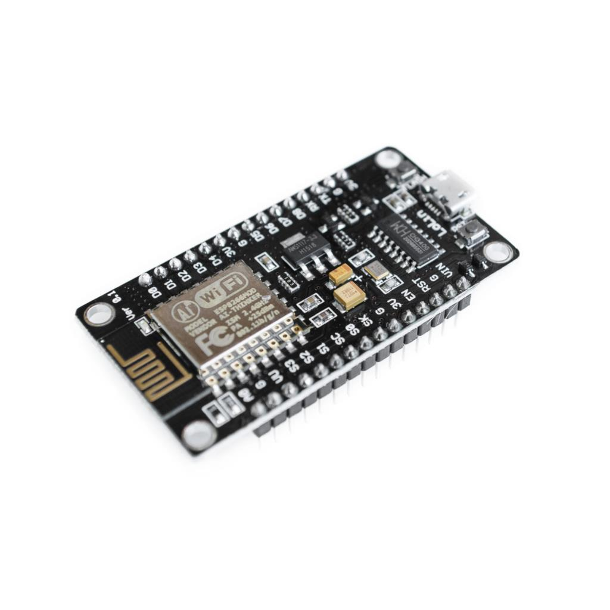
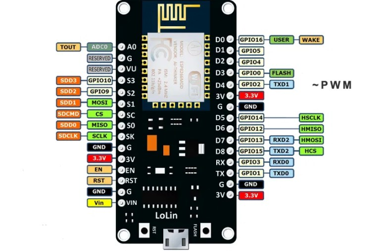
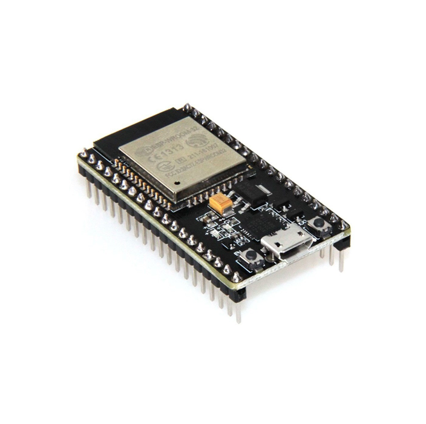

# **Sesion de trabajo 1**

>### **Objetivos**
> * Conocer las herramientas de software y hardware del laboratorio.
> * Realizar los primeros experimentos para comprender el proceso de desarrollo en capa fisica.


## Material de estudio

En esta sesión nos centraremosen la sección **Getting Started with IoT** ([link](https://github.com/microsoft/IoT-For-Beginners/tree/main/1-getting-started)) del repositorio de estudio guia del curso [IoT-For-Beginner](https://github.com/microsoft/IoT-For-Beginners). 

Las presentaciones de la sección  a estudiar (**Getting Started with IoT**) se encuentran en el siguiente [link](https://github.com/microsoft/IoT-For-Beginners/tree/main/slides). En esta sesión vamos a ir un poco poco en desorden y nos iniciaremos centrando en la presentación de la lección 3: **Interact with the physical world with sensors and actuators** ([Interact with the physical world](https://github.com/microsoft/IoT-For-Beginners/blob/main/1-getting-started/lessons/3-sensors-and-actuators/README.md)).

No obstante como recomendación le sugerimos que le pegue una ojeada a las diapositivas de las lecciones previas:
* **Leccion 1**: Getting Started - Introduction to IoT ([link](https://github.com/microsoft/IoT-For-Beginners/blob/main/slides/lesson-1.pdf))
* **Leccion 2**: A deep dive! ([link](https://github.com/microsoft/IoT-For-Beginners/blob/main/slides/lesson-2.pdf)).

## Herramientas del laboratorio  

En el laboratorio hay un gran numero de elementos para prototipado. En la siguiente tabla describe los elementos de hardware que usaremos en este laboratorio:

### Sistemas de desarrollo

|Elemento|Descripción|
|--|--|
|Arduino Uno|Placa de desarrollo Arduino Uno ([link](https://docs.arduino.cc/hardware/uno-rev3))|
|Tarjeta de desarrollo ESP8266 NodeMCU WiFi Devkit|Tarjeta de desarrollo basada en ESP8266 ([link](NodeMCU-V3.pdf))|
|Tarjeta de desarrollo NodeMCU-32S| Tarjeda de desarrollo basada en el ESP-32S ([link](nodemcu-32s_product_specification.pdf))

### Kit de sensores

|Elemento|Descripción|
|--|--|
|Grove - Starter Kit v3|Kit de desarrollo para prototipado rapido ([link](https://wiki.seeedstudio.com/Grove_Starter_Kit_v3/))|
|37 sensor kit Elegoo| Kit de sensores Elegoo para prototipado rapido ([link](http://spot.pcc.edu/~dgoldman/labs/37SENSORKIT.pdf))|
|AlphaBot2 robot building kit for Arduino/Pi/PiZero| Kit para prototipado de robots AlphaBot2 ([link](https://www.waveshare.com/wiki/AlphaBot2))|
|Landzo 37 In 1 Sensors Kit For Arduino|Kit de sensores Landzo para prototipado ([link](https://www.instructables.com/Arduino-37-in-1-Sensors-Kit-Explained/))

### Bases para plataformas de desarrollo

|Elemento|Descripción|
|--|--|
|Base Shield V2| Base para facil conexión de componentes con el arduino uno ([link](https://wiki.seeedstudio.com/Base_Shield_V2/))|
|Grove Base Shield for NodeMCU V1.0|Tarjeta para conexión plug&play de componentes electronicos con la placa NodeMCU ([link](https://wiki.seeedstudio.com/Grove_Base_Shield_for_NodeMCU_V1.0/))|

## Sistemas de desarrollo

A continuación se van a tratar de manera muy breve los conocimientos basicos necesarios para trabajar con los sistemas de desarrollo. Para empezar, lo mas importante consiste en el **Cacharreo** y la **creatividad**, por lo demas, en internet hay un monton de recursos, videos y tutoriales cuya calidad supera en creces a la aqui expuesta de modo que nuestro objetivo será solamente se va hacer enfasis en los pasos necesarios y básicos para empezar.

### Arduino UNO R3

La placa Arduino UNO es una plataforma de código abierto basada en el microcontrolador ATmega328P cuya alimentación es a 5V (cuando la alimentación es por USB) o en un voltaje DC entre 7 - 12 V cuando la alimentación es a traves del conector jack.


El primer paso es conocer la distribución de pines y su funcionalidad (Arduino UNO pinout) la cual es mostrada en la siguiente figura:


Para mayor información sobre la placa puede consultar el enlace [Arduino Uno Board Anatomy
](https://docs.arduino.cc/tutorials/uno-rev3/BoardAnatomy). La siguiente tabla resume la información sobre los pines para esta placa:

|Tipo|Notación pines (placa)|
|---|---|
|Digital/GPIO|```D0```, ```D1```, ```D2```, ```~D3```, ```D4```, ```~D5```, ```~D6```, <br> ```D7```, ```D8```, ```~D9```|
|Analog in|```A0```, ```A1```, ```A2```, ```A3```, ```A4```, ```A5```|
|PWM|```~D3```, ```~D5```, ```~D6```, ```~D9```, ```~D10```, ```~D11```|
|Serial (UART)|```Tx->```, ```Rx<-```|
|I2C|```A4/SDA```, ```A5/SCL```|
|Digital SPI|```~D10/SS```, ```~D11/MOSI```, ```D12/MISO```, ```D13/SCK```|
|Interrupt|```D1/INT0```, ```D3/INT1```|

Para mas información sobre la placa Arduino UNO puede consultar la documentación en [UNO R3](https://docs.arduino.cc/hardware/uno-rev3).

### Tarjeta de desarrollo ESP8266 NodeMCU WiFi Devkit

Existen diferentes plataformas de desarrollo para el SoC ESP8266 ([link1](https://www.espressif.com/en/products/modules/esp8266) - [link2](https://makeradvisor.com/best-esp8266-wi-fi-development-board/)). En el laboratorio se dispone de la NodeMCU ESP8266 development board ([link](https://diyi0t.com/esp8266-nodemcu-tutorial/)). 



La tarjeta de desarrollo tiene tres pines de 3.3 V y cuatro pines a tierra para la conexión con otros dispositivos. Así mismo la tarjeta tiene dos leds (activos en bajo) integrados conectasos a los pines ```D4``` (```GPIO2```) y ```D0``` (```GPIO16```). El microcontrolados ESP8266 microcontroller almacena un **sketch** (programa) en una memoria flash con la cual se comunica usando una interface SDIO (Secure Digital Input-Output). A continuación se muestra el diagrama de entradas y salidas de la placa de desarrollo.



La siguiente tabla resume el mapa de pines de manera mas simplificada. 

|Tipo|Notación pines (placa)|
|---|---|
|Digital/GPIO|```D0```, ```D1```, ```D2```, ```D3```, ```D4```, ```D5```, ```D6```, ```D7```, ```D8```|
|Analog in|```A0```|
|PWM|```D0```, ```D1```, ```D2```, ```D3```, ```D4```, ```D5```, ```D6```, ```D7```, ```D8```|
|Serial (UART)|```Tx [TXD0]```, ```Rx [RXD0]```, ```D8 [TXD2]```, ```D7 [RXD2]```|
|I2C|```D1 [SCL]```, ```D2 [SDA]```|
|Digital SPI|```SC [CS]```, ```S1 [MOSI]```, ```S0 [MISO]```, ```SK [SDCLK]```|


El nombre de los pines de NodeMCU tiene una nomenclatura diferente de la que utiliza el ESP8266.

Por ejemplo los pines D0, D1, y D2 en la NodeMCU correponden con GPIO16, 5 y 4 en el ESP8266 tal y como se muestra en la siguiente tabla tomada de wikipedia.

|IO index|ESP8266 pin|
|----|----|
|D0 |GPIO16 |
|D1	|GPIO5 |
|D2	|GPIO4 |
|D3	|GPIO0 |
|D4	|GPIO2 |
|D5	|GPIO14 |
|D6	|GPIO12 | 
|D7	|GPIO13 |
|D8	|GPIO15 |
|D9	|GPIO3 |
|D10 |GPIO1 |
|D11 |GPIO9 |
|D12 |GPIO10| |

Para mas información al respecto puede consultar el link [ESP8266 Pinout Reference: Which GPIO pins should you use?](
https://randomnerdtutorials.com/esp8266-pinout-reference-gpios/)

### Tarjeta de desarrollo NodeMCU-32S

Un sistema de desarrollo ESP32 (por ejemplo el NodeMCU-32S) esta basado en el microcontrolador ESP32 el cual cuenta con funcionalidad Wi-Fi y Bluetooth. La tarjeta de desarrollo opera a 3.3 V y es alimentada a traves de una conexión micro-USB de 5 V o directamente a 3.3 V a traves del pin VIN. Cuando se usa esta tarjeta de desarrollo es importante tener en cuenta que los pines GPIO no son tolerantes a 5 V, y la maxima corriente que pueden suministrar es de 12 mA.



La siguiente figura muestra el diagrama de pines asociado a la tarjeta de desarrollo [Nodemcu-32s WIFI MODULE](https://docs.ai-thinker.com/_media/esp32/docs/nodemcu-32s_product_specification.pdf).


Tal y como se muestra en la siguiente figura, el modulo Nodemcu-32s tiene un total de 38 puertos:


La siguiente tabla resume la función principal algunos de estos:

|Tipo|Notación pines (placa)|
|---|---|
|Digital (Only input)|```P34 [GPIO34]```, ```P35 [GPIO35]```, ```SVP [GPIO36]```, ```SVN [GPIO39]```|
|Analog in|```SVP [GPIO36]```, ```SVN [GPIO39]```, ```P35 [GPIO 35]```, <br>```P34 [GPIO34]```, ```P32 [GPIO32]```, ```P33 [GPIO 33]```, <br>```P25 [GPIO25]```, ```P26 [GPIO26]```, ```P27 [GPIO27]```, <br>```P14 [GPIO14]```, ```P12 [GPIO12]```,  ```P13 [GPIO13]```, <br>```P15 [GPIO15]```, ```P2 [GPIO2]```, ```P0 [GPIO0]```, <br>```P4 [GPIO4]```|
|PWM|```SVP [GPIO36]```, ```SVN [GPIO39]```, ```P35 [GPIO 35]```, <br>```P34 [GPIO 34]```, ```P32 [GPIO 32]```, ```P33 [GPIO 33]```, <br>```P25 [GPIO25]```, ```P26 [GPIO26]```, ```P27 [GPIO27]```, <br>```P14 [GPIO14]```, ```P12 [GPIO12]```,  ```P13 [GPIO13]```, <br>```P15 [GPIO15]```, ```P2 [GPIO2]```, ```P0 [GPIO0]```, <br>```P4 [GPIO4]```|
|Serial (UART)|```Tx [GPI1]```, ```Rx [GPI3]```, ```D8 [TXD2]```, ```D7 [RXD2]```|
|I2C|```P22 [GPI22/SCL]```, ```P21 [GPI21/SDA]```|
|Digital SPI|```P23 [MOSI]```, ```P19 [MISO]```, ```P18 [SCK]```, ```P5 [SS]```|
|Flash SPI|```CLK [GPIO6/FLASHCLK]```, ```SD0 [GPIO7/FLASHD0]```, <br>```SD1 [GPIO7/FLASHD1]```, ```CMD [GPIO7/FLASHCMD]```,<br> ```SD2 [GPIO9/FLASHD2]```, ```SD3 [GPIO9/FLASHD3]```|
|Capacitive touch|```P0 [GPIO4]/TOUCH1```, ``` P4 [GPIO0]/TOUCH0```, <br>``` P2 [GPIO2/TOUCH2]```, ``` P15 [GPIO15/TOUCH3]```, <br>``` P13 [GPIO13/TOUCH4]```, ``` P12 [GPIO12/TOUCH5]```,<br> ``` P14 [GPIO14/TOUCH6]```, ``` P27 [GPIO7/TOUCH7]```|


## Notas

* Esta es una versión preliminar por lo que no esta excenta de errores. Se invita a comentarnos si ve un error para corregirlo.


## Enlaces

* https://blog.uelectronics.com/tarjetas-desarrollo/internet-of-things/como-instalar-las-placas-esp32-y-programarlas/
* https://www.waveshare.com/nodemcu-32s.htm
* https://en.wikipedia.org/wiki/ESP32
* https://docs.espressif.com/projects/esp-idf/en/latest/esp32/
* https://esphome.io/devices/nodemcu_esp32.html
* https://www.waveshare.com/nodemcu-32s.htm
* https://docs.espressif.com/projects/arduino-esp32/en/latest/index.html
* https://www.tiendatec.es/electronica/placas-de-desarrollo/1001-placa-esp32-devkit-wifi-bt-4mb-iot-8472496015325.html
* https://randomnerdtutorials.com/esp32-pinout-reference-gpios/
* https://naylampmechatronics.com/espressif-esp/384-nodemcu-32-30-pin-esp32-wifi.html
* https://en.wikipedia.org/wiki/ESP8266
* https://esphome.io/devices/nodemcu_esp8266.html
* https://github.com/nodemcu/nodemcu-devkit-v1.0
* https://www.waveshare.com/nodemcu.htm
* https://www.wikiwand.com/en/ESP8266
* https://upcommons.upc.edu/bitstream/handle/2117/105042/Memoria_TFG_Carles_Ubach.pdf?sequence=1&isAllowed=y
* https://diyi0t.com/esp8266-nodemcu-tutorial/
* https://naylampmechatronics.com/espressif-esp/153-nodemcu-v2-esp8266-wifi.html
* https://microcontrollerslab.com/esp32-pinout-use-gpio-pins/
* https://theiotprojects.com/power-supply-board-for-nodemcu-esp8266/
* https://github.com/vowstar
* https://github.com/tuanpmt?tab=repositories
* https://programarfacil.com/podcast/nodemcu-tutorial-paso-a-paso/
* https://www.wikiwand.com/en/ESP8266
* https://randomnerdtutorials.com/esp8266-pinout-reference-gpios/
* https://learn.sparkfun.com/tutorials/esp8266-thing-hookup-guide/introduction
* https://elosciloscopio.com/tutorial-i2c-para-arduino-esp8266-y-esp32/
* https://www.wikiwand.com/en/NodeMCU
* https://naylampmechatronics.com/ardusystem-tarjetas/8-uno-r3.html
* https://docs.espressif.com/projects/arduino-esp32/en/latest/index.html#
* https://www.espressif.com/en/support/documents/technical-documents
* https://docs.ai-thinker.com/en/esp32/boards/nodemcu_32s
* https://docs.ai-thinker.com/en/esp32s2
* https://nodemcu.readthedocs.io/en/release/
* https://www.elecrow.com/wiki/index.php?title=Main_Page
* https://github.com/josejuansanchez/iot-demo
* https://diyi0t.com/
* https://naylampmechatronics.com/espressif-esp/384-nodemcu-32-30-pin-esp32-wifi.html
* https://elosciloscopio.com/
* https://diyi0t.com/i2c-tutorial-for-arduino-and-esp8266/
* https://dynamoelectronics.com/tienda/esp32s-board-desarrollo-con-wifi-bluetooth/
* https://esphome.io/index.html


