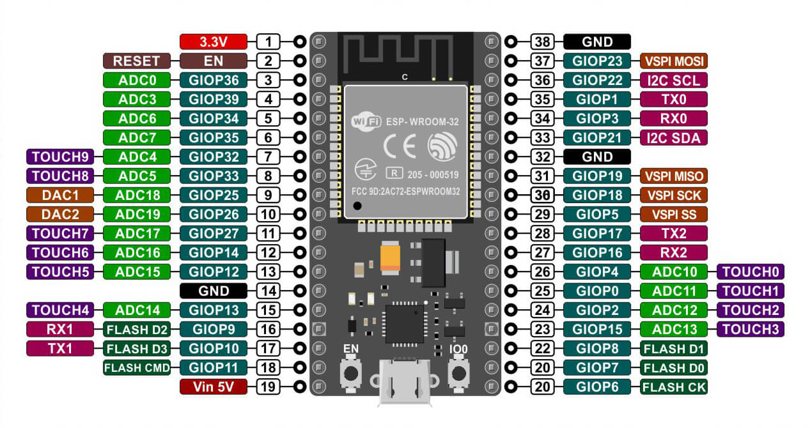

# **Sesion de trabajo 1**

>### **Objetivos**
> * Conocer las herramientas de software y hardware del laboratorio.
> * Realizar los primeros experimentos para comprender el proceso de desarrollo en capa fisica.

## Herramientas del laboratorio  

En el laboratorio hay un gran numero de elementos para prototipado. En la siguiente tabla describe los elementos de hardware que usaremos en este laboratorio:

### Sistemas de desarrollo

|Elemento|Descripción|
|--|--|
|Arduino Uno|Placa de desarrollo Arduino Uno ([link](https://docs.arduino.cc/hardware/uno-rev3))|
|Tarjeta de desarrollo ESP8266 NodeMCU WiFi Devkit|Tarjeta de desarrollo basada en ESP8266 ([link](NodeMCU-V3.pdf))|
|Tarjeta de desarrollo NodeMCU-32S| Tarjeda de desarrollo basada en el ESP-32S ([link](nodemcu-32s_product_specification.pdf))

### Kit de sensores

|Elemento|Descripción|
|--|--|
|Grove - Starter Kit v3|Kit de desarrollo para prototipado rapido ([link](https://wiki.seeedstudio.com/Grove_Starter_Kit_v3/))|
|37 sensor kit Elegoo| Kit de sensores Elegoo para prototipado rapido ([link](http://spot.pcc.edu/~dgoldman/labs/37SENSORKIT.pdf))|
|AlphaBot2 robot building kit for Arduino/Pi/PiZero| Kit para prototipado de robots AlphaBot2 ([link](https://www.waveshare.com/wiki/AlphaBot2))|
|Landzo 37 In 1 Sensors Kit For Arduino|Kit de sensores Landzo para prototipado ([link](https://www.instructables.com/Arduino-37-in-1-Sensors-Kit-Explained/))

### Bases para plataformas de desarrollo

|Elemento|Descripción|
|--|--|
|Base Shield V2| Base para facil conexión de componentes con el arduino uno ([link](https://wiki.seeedstudio.com/Base_Shield_V2/))|
|Grove Base Shield for NodeMCU V1.0|Tarjeta para conexión plug&play de componentes electronicos con la placa NodeMCU ([link](https://wiki.seeedstudio.com/Grove_Base_Shield_for_NodeMCU_V1.0/))|

## Sistemas de desarrollo
* https://esphome.io/index.html

### Arduino UNO R3

### Tarjeta de desarrollo ESP8266 NodeMCU WiFi Devkit

* https://en.wikipedia.org/wiki/ESP8266
* https://esphome.io/devices/nodemcu_esp8266.html
* https://github.com/nodemcu/nodemcu-devkit-v1.0
* https://www.waveshare.com/nodemcu.htm

### Tarjeta de desarrollo NodeMCU-32S

* https://blog.uelectronics.com/tarjetas-desarrollo/internet-of-things/como-instalar-las-placas-esp32-y-programarlas/
* https://www.waveshare.com/nodemcu-32s.htm
* https://en.wikipedia.org/wiki/ESP32
* https://docs.espressif.com/projects/esp-idf/en/latest/esp32/
* https://esphome.io/devices/nodemcu_esp32.html
* https://www.waveshare.com/nodemcu-32s.htm
* https://docs.espressif.com/projects/arduino-esp32/en/latest/index.html
* https://www.tiendatec.es/electronica/placas-de-desarrollo/1001-placa-esp32-devkit-wifi-bt-4mb-iot-8472496015325.html

## Pendiente
1. Compresión sobre los sensores.
2. 

* https://docs.espressif.com/projects/arduino-esp32/en/latest/index.html#
* https://www.espressif.com/en/support/documents/technical-documents
* https://docs.ai-thinker.com/en/esp32/boards/nodemcu_32s
* https://docs.ai-thinker.com/en/esp32s2
* https://nodemcu.readthedocs.io/en/release/
* https://www.elecrow.com/wiki/index.php?title=Main_Page

