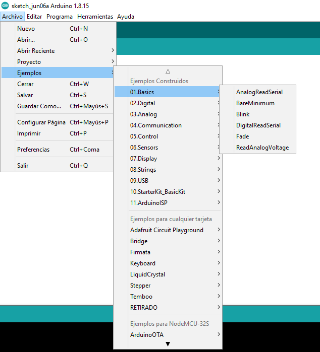

# Trabajando con el Arduino UNO

> ### Objetivos
> * Aprender a usar la tarjeta de desarrollo Arduino UNO.
> * Comprender el API basica de entrada y salida del lenguaje Arduino.
> * Comprender y adaptar los ejemplos usando el kit de inicio Groove.
> * Comprender el uso de algunos sensores y actuadores basicos.

## Introducción

La tarjeta de desarrollo Arduino UNO es la plataforma ideal para empezar a realizar las pruebas necesarias para el curso. 

## Material requerido

1. Arduino UNO.
2. Cables USB.
3. Grove - Starter Kit v3 ([link](https://wiki.seeedstudio.com/Grove_Starter_Kit_v3/))
4. Base Shield V2 ([link](https://wiki.seeedstudio.com/Base_Shield_V2/))

## Pinout

Para empezar a trabajar con cualquier plataforma de desarrollo es necesario conocer como mínimo el mapa de pines, el cual se muestra a continuación:


Es importante notar, que los pines son multifuncionales, es decir, pueden ser empleados para diferentes funciones. La determinación de la función que puede llevar un pin se hace por programación.

Para mas información sobre esta tarjeta, le recomendamos revisar el link [Overview of the Arduino UNO Components](https://docs.arduino.cc/tutorials/uno-rev3/intro-to-board).

## Funciones

El documento [Arduino Cheat Sheet](Arduino%20Cheat%20Sheet.pdf) contine un resumen de algunas de las principales funciones que se usan para programar plataformas Arduino. Para mas información sobre estas puede consultar la sección [Language Reference](https://www.arduino.cc/reference/en/).

## Librerias

Ademas de las funciones, propias del API de Arduino, es posible hacer uso de librerias para agregar funcionalidad extra (tal y como sucede con el software). Una de las mayores fortalezas de la plataforma Arduino se encuentra en que esta posee una gran numero de librerias. En la sección [Libraries](https://www.arduino.cc/reference/en/libraries/) se encuentra toda la información relacionada con diferentes librerias existentes, hardware soportado y, adicionalmente, se muestra como realizar una libreria. Hay tres cosas fundamentales para trabajar con librerias:
1. Instalación de librerias ([Installing Libraries](https://docs.arduino.cc/software/ide-v1/tutorials/installing-libraries))
2. Escritura de librerias ([Writing a Library for Arduino](https://docs.arduino.cc/learn/contributions/arduino-creating-library-guide))
3. Guia de estilo ([Arduino Style Guide for Creating Libraries](https://docs.arduino.cc/learn/contributions/arduino-library-style-guide))

## Ejemplos basicos

Cuando se tienen unas nociones basicas de programación, la mejor manera para aprender consiste en leer, ejecutar y comprender código a traves del desarrollo de ejemplos sencillos. Luego, y luego, aplicando lo ya aprendido realizar la adaptación del código al caso particular. Para hacer esto, nuestra recomendación es que tenga a la mano los siguientes materiales:

|Item|Material|Link|
|---|---|---|
|1 |Language Reference|https://www.arduino.cc/reference/en/|
|2|Built-in Examples|https://docs.arduino.cc/built-in-examples/|
|3|Libraries|https://www.arduino.cc/reference/en/libraries/|
|4|Tutorials|https://docs.arduino.cc/tutorials/|

Como punto de partida tenga a la mano, minimamente los enlaces asociados a los items 1 y 2 de la tabla anterior y la [Arduino Cheat Sheet](Arduino%20Cheat%20Sheet.pdf). La idea es empezar a mirar unos cuantos ejemplos los cuales vienen implementados en IDE de arduino tal y como se muestra en la siguiente figura:



Veamos algunos ejemplos.

### Ejemplo 1

En este ejemplo se pone a parpadear un led a un periodo de 2 segundos. La descripción completa del ejemplo se encuentra en [Blink](https://docs.arduino.cc/built-in-examples/basics/Blink). El codigo se muestra a continuación:

```ino
void setup() {
  pinMode(LED_BUILTIN, OUTPUT);
}

// the loop function runs over and over again forever
void loop() {
  digitalWrite(LED_BUILTIN, HIGH);  
  delay(1000);                       
  digitalWrite(LED_BUILTIN, LOW);    
  delay(1000);                       
}
```

Tambien se muestra el esquematico asociado:


Y el diagrama de conexión


El proceso de trabajo a lo largo de esta sesión de trabajo será:
1. Descargar codigo.
2. Montar circuito.
3. Programar.
4. Probar.

**Pregunta**:
1. ¿Que funciones del API se usaron?
2. ¿Que hace cada una?

### Ejemplo 2 

Este ejemplo se encuentra en [How to Wire and Program a Button](https://docs.arduino.cc/built-in-examples/digital/Button). En éste se prende un led cuando se presiona un switch.

**Codigo**

```ino
const int buttonPin = 2;     
const int ledPin =  13;      

int buttonState = 0;         

void setup() {
  pinMode(ledPin, OUTPUT);
  pinMode(buttonPin, INPUT);
}

void loop() {
  buttonState = digitalRead(buttonPin);

  if (buttonState == HIGH) {
    digitalWrite(ledPin, HIGH);
  } else {
    digitalWrite(ledPin, LOW);
  }
}
```

**Esquematico**


**Conexiones**


**Preguntas**:
1. ¿Que funciones del API se usaron?
2. ¿Que hace cada una?

### Ejemplo 3

Este ejemplo es tomado de [Fading](https://docs.arduino.cc/built-in-examples/analog/Fading). En este ejemplo se modifica el brillo de un led de manera automatica.

```ino

int ledPin = 9;    

void setup() {
  // nothing happens in setup
}

void loop() {

  for (int fadeValue = 0 ; fadeValue <= 255; fadeValue += 5) {
    analogWrite(ledPin, fadeValue);
    delay(30);

  }

  for (int fadeValue = 255 ; fadeValue >= 0; fadeValue -= 5) {
    analogWrite(ledPin, fadeValue);
    delay(30);
  }
}
```

**Esquematico**


**Conexiones**


**Preguntas**:
1. ¿Que funciones del API se usaron?
2. ¿Que hace cada una?

### Ejemplo 4

Este ejemplo es tomado de [Analog Read Serial](https://docs.arduino.cc/built-in-examples/basics/AnalogReadSerial). Aqui, se lee un potenciometro y se imprime su estado a traves del monitor serial.

**Código**

```ino

void setup() {
  Serial.begin(9600);
}


void loop() {
  int sensorValue = analogRead(A0);
  Serial.println(sensorValue);
  delay(1);        
}

```

**Esquematico**


**Conexiones**


**Preguntas**:
1. ¿Que funciones del API se usaron?
2. ¿Que hace cada una?


### Ejemplo 5

Este ejemplo es tomado de [Analog In, Out Serial](https://docs.arduino.cc/built-in-examples/analog/AnalogInOutSerial). Aqui, se usa un potenciometro para controlar el brillo de un led; adicionalmente, se imprime su estado a traves del monitor serial.

**Código**

```ino
const int analogInPin = A0;  
const int analogOutPin = 9; 

int sensorValue = 0;        
int outputValue = 0;        

void setup() {
  Serial.begin(9600);
}

void loop() {
  sensorValue = analogRead(analogInPin);
  outputValue = map(sensorValue, 0, 1023, 0, 255);
  analogWrite(analogOutPin, outputValue);
  Serial.print("sensor = ");
  Serial.print(sensorValue);
  Serial.print("\t output = ");
  Serial.println(outputValue);
  delay(2);
}
```

**Esquematico**


**Conexiones**


**Preguntas**:
1. ¿Que funciones del API se usaron?
2. ¿Que hace cada una?

## Enlaces

* https://wiki.seeedstudio.com/Grove_Starter_Kit_v3/
* https://learn.adafruit.com/groups/ladyadas-learn-arduino
* https://learn.adafruit.com/series/learn-arduino
* https://www.sparkfun.com/products/15631
* https://learn.sparkfun.com/tutorials/tinker-kit-circuit-guide
* https://learn.adafruit.com/experimenters-guide-for-metro