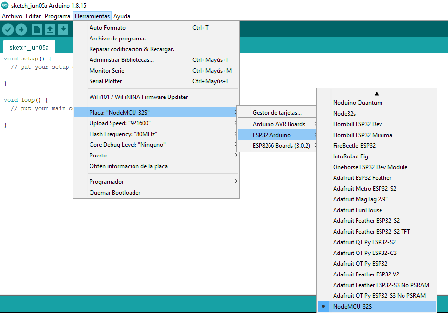

# Trabajando con el ESP32

> ### Objetivos
> * Aprender a usar la tarjeta de desarrollo ESP32.
> * Comprender el API basica de entrada y salida del lenguaje Arduino.
> * Comprender y adaptar los ejemplos usando ...
> * Comprender el uso de algunos sensores y actuadores basicos...


## Introducción

El ESP32 ([ESP32 Series Datasheet](https://www.espressif.com/sites/default/files/documentation/esp32_datasheet_en.pdf)) es el sucesor del ESP8266. Este ademas de soportar conectividad Wi-Fi, soporta tambien conectividad Bluetooth (4.2 y Low Energy).

Existen diferentes plataformas de desarrollo ([ESP32 Development Boards Review and Comparison](https://makeradvisor.com/esp32-development-boards-review-comparison/)). En nuestro caso vamos a usar la NodeMCU-32S de Ai-Thinker ([Nodemcu-32s Datasheet](https://docs.ai-thinker.com/_media/esp32/docs/nodemcu-32s_product_specification.pdf))

## Material requerido

1. Tarjeta NodeMCU-32S
2. Cable USB tipo C.
3. Grove - Starter Kit v3 ([link](https://wiki.seeedstudio.com/Grove_Starter_Kit_v3/))
4. Grove Base Shield for NodeMCU V1.0
 ([link](https://wiki.seeedstudio.com/Grove_Base_Shield_for_NodeMCU_V1.0/))


## Trabajo previo con fritzing

Antes de empezar a trabajar 

Para realizar prototipado empleando elementos (de diferentes fabricantes) disponibles en kits de desarrollo a trabajar en el laboratorio siga los pasos ilustrados en el tutorial [How to Add Components in Fritzing](https://steemit.com/utopian-io/@thinkingmind/how-to-add-components-in-fritzing) (para comprender bien el procedimiento puede ver el siguiente [video](https://www.youtube.com/watch?v=lEEkYk5IQVY) antes de empezar). Para ello agregar los siguientes componentes:
1. **ESP32**: Cuya parte ([ESP32S_HiLetgo.fzpz](https://forum.fritzing.org/uploads/default/original/2X/1/1c6c1b0e5bff03730a40b696b354783432fbb506.fzpz)) puede ser decargada de la pagina[ESP32S-HiLetgo Dev Boad with Pinout Template](https://forum.fritzing.org/t/esp32s-hiletgo-dev-boad-with-pinout-template/5357?u=steelgoose). El pinout de esta parte (en fritzing) se muestra en la siguiente imagen:


2. **Kid  de sensores Elegoo**: Ver link anterior...


## Pinout

A continuación se muestra el diagrama de pines:


Mas exactamente para el NodeMCU-32s tiene un total de 38 pines los cuales se resumen en la siguiente figura:


La siguiente tabla tomada del datasheet, describe cada uno de estos pines:


|No. |Pin Name |Functional Description|
|---|---|---|
|1 |3.3V | Module power supply pin |
|2 |EN | Chip Enabled Pin, Active High |
|3 |SVP | GPIO36，ADC1_CH0，RTC_GPIO0 |
|4 |SVN | GPIO39，ADC1_CH3，RTC_GPIO3|
|5 |P34 | GPIO34，ADC1_CH6，RTC_GPIO4|
|6 |P35 | GPIO35，ADC1_CH7，RTC_GPIO5|
|7 |P32 | GPIO32, XTAL_32K_P (32.768kHz Crystal input), ADC1_CH4, TOUCH9,RTC_GPIO9 |
|8 |P33 |GPIO33, XTAL_32K_N (32.768kHz Crystal output),ADC1_CH5, TOUCH8,RTC_GPIO8|
|9 |P25 |GPIO25，DAC_1，ADC2_CH8，RTC_GPIO6，EMAC_RXD0|
|10 |P26 |GPIO26，DAC_2，ADC2_CH9，RTC_GPIO7，EMAC_RX_DV|
|11 |P27 |GPIO27，ADC2_CH7，TOUCH7，RTC_GPIO17，EMAC_RX_DV|
|12 |P14 |GPIO14, ADC2_CH6, TOUCH6, RTC_GPIO16, MTMS, HSPICLK, HS2_CLK,SD_CLK, EMAC_TXD2|
|13 |P12 |GPIO12, ADC2_CH5, TOUCH5, RTC_GPIO15, MTDI, HSPIQ, HS2_DATA2,SD_DATA2, EMAC_TXD3|
|14 |GND |GND|
|15 |P13 |GPIO13, ADC2_CH4, TOUCH4, RTC_GPIO14, MTCK, HSPID, HS2_DATA3,SD_DATA3, EMAC_RX_ER|
|16 |SD2 |GPIO9, SD_DATA2, SPIHD, HS1_DATA2, U1RXD|
|17 |SD3 |GPIO10, SD_DATA3, SPIWP, HS1_DATA3, U1TXD|
|18 |CMD |GPIO11, SD_CMD, SPICS0, HS1_CMD, U1RTS|
|19 |5V |Module power supply pin|
|20 |CLK |GPIO6, SD_CLK, SPICLK, HS1_CLK, U1CTS|
|21 |SD0 |GPIO7, SD_DATA0, SPIQ, HS1_DATA0, U2RTS|
|22 |SD1 |GPIO8, SD_DATA1, SPID, HS1_DATA1, U2CTS|
|23 |P15 |GPIO15, ADC2_CH3, TOUCH3, MTDO, HSPICS0, RTC_GPIO13, HS2_CMD,SD_CMD, EMAC_RXD3|
|24 |P2 |GPIO2, ADC2_CH2, TOUCH2, RTC_GPIO12, HSPIWP, HS2_DATA0,SD_DATA0|
|25 |P0 |GPIO0, ADC2_CH1, TOUCH1, CLK_OUT1,RTC_GPIO11, EMAC_TX_CLK; **Download mode: external pull low, running mode: floating or external pull high**|
|26 |P4 |GPIO4, ADC2_CH0, TOUCH0, RTC_GPIO10, HSPIHD, HS2_DATA1,SD_DATA1, EMAC_TX_ER|
|27 |P16 |GPIO16, HS1_DATA4, U2RXD, EMAC_CLK_OUT |
|28 |P17 |GPIO17, HS1_DATA5, U2TXD, EMAC_CLK_OUT_180 |
|29 |P5 |GPIO5, VSPICS0, HS1_DATA6, EMAC_RX_CLK|
|30 |P18| GPIO18, VSPICLK, HS1_DATA7|
|31 |P19| GPIO19, VSPIQ, U0CTS, EMAC_TXD0|
|32 |GND| GND|
|33 |P21| GPIO21, VSPIHD, EMAC_TX_EN|
|34 |RX| GPIO3, U0RXD, CLK_OUT2|
|35 |TX| GPIO1, U0TXD, CLK_OUT3, EMAC_RXD2|
|36 |P22| GPIO22, VSPIWP, U0RTS, EMAC_TXD1|
|37 |P23| GPIO23, VSPID, HS1_STROBE|
|38 |GND| GND|

Para conocer mas sobre el uso de los pines para esta plataforma se recomienda ver la pagina: [ESP32 Pinout Reference: Which GPIO pins should you use?](https://randomnerdtutorials.com/esp32-pinout-reference-gpios/)

## Arduino core for the ESP32, ESP32-S2, ESP32-S3 and ESP32-C3

De manera similar al ESP8266, el ESP32 puede programarse usando el API arduino. Para mas información puede consultar la documentación de este Core en el siguiente [link](https://docs.espressif.com/projects/arduino-esp32/en/latest/).

Antes de empezar a usar el core para el esp32s, es necesario instalar las librerias necesarias para ello. Para esto siga las instrucciones que se describen en el link [Installing the ESP32 Board in Arduino IDE (Windows, Mac OS X, Linux)](https://randomnerdtutorials.com/installing-the-esp32-board-in-arduino-ide-windows-instructions/)

Antes de analizar los ejemplos que se muestran a continuación se recomuenda que de un vistazo al link [Getting Started with the ESP32 Development Board](https://randomnerdtutorials.com/getting-started-with-esp32/) 

## Ejemplos

Antes de empezar a realizar los ejemplos, se debe seleccionar la tarjeta con la cual se va a trabajar (NodeMCU-32s) tal y como se muestra en la siguiente figura:



A continuación se van a mostrar los ejemplos hechos en arduino [link](../arduino_uno/)  adaptados a la plataforma ESP32.

### Ejemplo 1

Poner parpadear un led a un periodo de 2 segundos usando el led de la tarjeta ESP32 (Ejemplo adaptado de: [Blink](https://docs.arduino.cc/built-in-examples/basics/Blink)). 

```ino
void setup() {
  pinMode(LED_BUILTIN, OUTPUT);
}

// the loop function runs over and over again forever
void loop() {
  digitalWrite(LED_BUILTIN, HIGH);   
  delay(1000);                       
  digitalWrite(LED_BUILTIN, LOW);    
  delay(1000);                      
}
```

**Simulación online ejemplo 1**: [link](https://wokwi.com/projects/335030762714694227)

### Ejemplo 2

Prender el led integrado de la placa ESP32 cuando se presiona un switch. (Código adaptado para el ESP32 del link [How to Wire and Program a Button](https://docs.arduino.cc/built-in-examples/digital/Button))


```ino
const int buttonPin = 5;         //  (GPIO5)
const int ledPin =  LED_BUILTIN; 

// variables will change:
int buttonState = 0;         

void setup() {
  pinMode(ledPin, OUTPUT);
  pinMode(buttonPin, INPUT);
}

void loop() {
  buttonState = digitalRead(buttonPin);

  if (buttonState == HIGH) {
    digitalWrite(ledPin, HIGH);
  } else {
    digitalWrite(ledPin, LOW);
  }
}
```

**Simulación online ejemplo 2**: [link](https://wokwi.com/projects/335034266233602642)

A continuación se muestra el diagrama de conexión para este ejemplo:


Para entender mas se recomienda que mire el tutorial [ESP32 Digital Inputs and Digital Outputs (Arduino IDE)](https://randomnerdtutorials.com/esp32-digital-inputs-outputs-arduino/).

### Ejemplo 3

Modifica el brillo de un led (conectado al pin GPIO2) de manera automatica. (Código adaptado para el ESP32 del link [Fading a LED](https://docs.arduino.cc/built-in-examples/basics/Fade))

```ino
int ledPin = 2;    // GPIO2

void setup() {
  // nothing happens in setup
}

void loop() {
  for (int fadeValue = 0 ; fadeValue <= 255; fadeValue += 5) {
    analogWrite(ledPin, fadeValue);
    delay(30);
  }

  for (int fadeValue = 255 ; fadeValue >= 0; fadeValue -= 5) {
    analogWrite(ledPin, fadeValue);
    delay(30);
  }
}
```

**Simulación online ejemplo 3**: [link](https://wokwi.com/projects/335030762714694227)


El diagrama de conexión se muestra a continuación:


Para reforzar los conceptos adquiridos anteriormente ver el enlace [ESP32 PWM with Arduino IDE (Analog Output)](https://randomnerdtutorials.com/esp32-pwm-arduino-ide/).

### Ejemplo 4

Llevar al puerto serial el valor de voltaje de un potenciometro leido a traves del puerto analogo. Adicionalmente empleando una señal PWM, variar el grado de luminosidad del led integrado en la tarjeta ESP32. 

```ino
const int analogInPin = 15;  //  GPIO15
const int analogOutPin = LED_BUILTIN; // ESP32 led

int sensorValue = 0;        
int outputValue = 0;        

void setup() {
  Serial.begin(9600);
}

void loop() {
  sensorValue = analogRead(analogInPin);
  outputValue = map(sensorValue, 0, 4095, 0, 255); // ADC de 12 bits
  analogWrite(analogOutPin, outputValue);

  Serial.print("sensor = ");
  Serial.print(sensorValue);
  Serial.print("\t output = ");
  Serial.println(outputValue);

  delay(2);
}
```

**Simulación online ejemplo 4**: [link](https://wokwi.com/projects/335035080677261908)


El diagrama de conexión se muestra a continuación:


Para comprender mejor este ejemplo se recomienda reforzar viendo el link [ESP32 ADC – Read Analog Values with Arduino IDE](https://randomnerdtutorials.com/esp32-adc-analog-read-arduino-ide/).

## Enlaces

* https://makeabilitylab.github.io/physcomp/esp32/iot.html
* https://makeabilitylab.github.io/physcomp/resources/uw-courses.html
* https://randomnerdtutorials.com/esp32-pinout-reference-gpios/
* https://learn.sparkfun.com/tutorials/esp32-thing-hookup-guide#introduction
* https://learn.adafruit.com/adafruit-metro-esp32-s2/usage-with-adafruit-io
* https://naylampmechatronics.com/espressif-esp/384-nodemcu-32-30-pin-esp32-wifi.html
* https://randomnerdtutorials.com/getting-started-with-esp32/
* https://programarfacil.com/esp8266/programar-esp32-ide-arduino/
* https://randomnerdtutorials.com/installing-the-esp32-board-in-arduino-ide-windows-instructions/
* https://github.com/espressif/arduino-esp32
* http://esp32.net/
* https://stevenmhernandez.github.io/ESP32-CSI-Tool/
* https://github.com/espressif/arduino-esp32


<!---

https://docs.espressif.com/projects/esp-idf/en/latest/esp32/hw-reference/index.html

https://rntlab.com/question/esp32-devkit-fritzing-part-available/

http://omnigatherum.ca/wp/?p=228

https://docs.espressif.com/projects/esp-idf/en/latest/esp32/get-started/index.html


Instalar drives:

https://docs.espressif.com/projects/esp-idf/en/latest/esp32/get-started/windows-setup.html


https://espressif-docs.readthedocs-hosted.com/projects/arduino-esp32/en/latest/installing.html


Siga las instrucciones de para instalar..

https://randomnerdtutorials.com/installing-the-esp32-board-in-arduino-ide-windows-instructions/


Programas

Probar primero con es scann del wifi

Error:
https://espressif-docs.readthedocs-hosted.com/projects/arduino-esp32/en/latest/troubleshooting.html


Hold down the “BOOT” button in your ESP32 board while uploading/flashing.


https://randomnerdtutorials.com/solved-failed-to-connect-to-esp32-timed-out-waiting-for-packet-header/


```ino
// the setup function runs once when you press reset or power the board
void setup() {
  // initialize digital pin LED_BUILTIN as an output.
  pinMode(LED_BUILTIN, OUTPUT);
}

// the loop function runs over and over again forever
void loop() {
  digitalWrite(LED_BUILTIN, HIGH);   // turn the LED on (HIGH is the voltage level)
  delay(1000);                       // wait for a second
  digitalWrite(LED_BUILTIN, LOW);    // turn the LED off by making the voltage LOW
  delay(1000);                       // wait for a second
}
```

https://randomnerdtutorials.com/esp32-troubleshooting-guide/

------

https://espressif-docs.readthedocs-hosted.com/projects/arduino-esp32/en/latest/index.html


Pines en:

https://espressif-docs.readthedocs-hosted.com/projects/arduino-esp32/en/latest/boards/ESP32-DevKitC-1.html

Elementos usados:
* Shock switch module (Elegoo).

```ino
const int buttonPin = 5;              // the number of the pushbutton pin (GPIO5)
const int ledPin =  LED_BUILTIN;      // the number of the LED pin

// variables will change:
int buttonState = 0;         // variable for reading the pushbutton status

void setup() {
  // initialize the LED pin as an output:
  pinMode(ledPin, OUTPUT);
  // initialize the pushbutton pin as an input:
  pinMode(buttonPin, INPUT);
}

void loop() {
  // read the state of the pushbutton value:
  buttonState = digitalRead(buttonPin);

  // check if the pushbutton is pressed. If it is, the buttonState is HIGH:
  if (buttonState == HIGH) {
    // turn LED on:
    digitalWrite(ledPin, HIGH);
  } else {
    // turn LED off:
    digitalWrite(ledPin, LOW);
  }
}
```

Actividad:
1. En vez de usar el led de la tarjeta, use el led conectado en el GPIO22 y el boton al 15. (Pista: https://microcontrollerslab.com/push-button-esp32-gpio-digital-input/) 

---------------------------

Lectura de un potenciometro


https://microcontrollerslab.com/adc-esp32-measuring-voltage-example/

https://randomnerdtutorials.com/esp32-digital-inputs-outputs-arduino/


https://esp32io.com/tutorials/esp32-button
https://esp32io.com/tutorials/esp32-potentiometer-fade-led

```ino
/*
  Ejemplo adaptado para el ESP32 de:

  https://www.arduino.cc/en/Tutorial/BuiltInExamples/AnalogInOutSerial
*/

const int analogInPin = 15;  // Analog input pin that the potentiometer is attached to GPIO15
const int analogOutPin = LED_BUILTIN; // Analog output pin that the LED is attached to ESP32 led.

int sensorValue = 0;        // value read from the pot
int outputValue = 0;        // value output to the PWM (analog out)

void setup() {
  // initialize serial communications at 9600 bps:
  Serial.begin(9600);
}

void loop() {
  // read the analog in value:
  sensorValue = analogRead(analogInPin);
  // map it to the range of the analog out:
  outputValue = map(sensorValue, 0, 4095, 0, 255); // ADC de 12 bits
  // change the analog out value:
  analogWrite(analogOutPin, outputValue);

  // print the results to the Serial Monitor:
  Serial.print("sensor = ");
  Serial.print(sensorValue);
  Serial.print("\t output = ");
  Serial.println(outputValue);

  // wait 2 milliseconds before the next loop for the analog-to-digital
  // converter to settle after the last reading:
  delay(2);
}
```


---------------------------

Fritizing parts


Vamos a agregar la de esta pagina:
https://forum.fritzing.org/t/esp32s-hiletgo-dev-boad-with-pinout-template/5357

Add: https://fritzing.org/parts/#:~:text=Fritzing%20is%20installed%20with%20a,properties%20in%20the%20info%20palette.

https://forum.fritzing.org/t/adding-a-library-on-fritzing/6950

Para saber ver:https://learn.adafruit.com/using-the-adafruit-library-with-fritzing/import-the-library-into-fritzing


http://digitalconcepts.net.au/fritzing/index.php?op=parts
https://github.com/wero1414/Platzi_Curso_IoT

https://docs.arduino.cc/
https://docs.arduino.cc/tutorials/generic/simple-audio-player#the-circuit
https://create.arduino.cc/projecthub


-->
