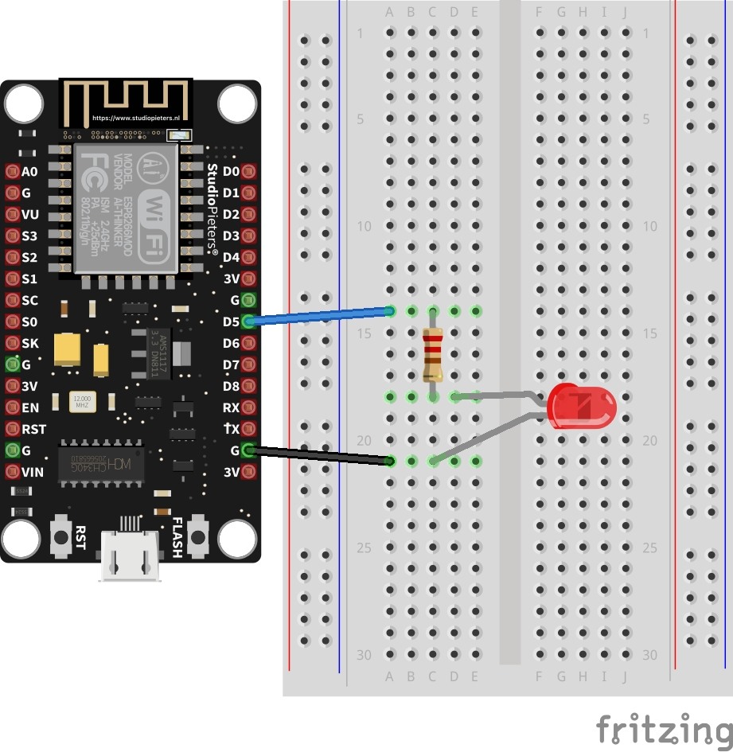
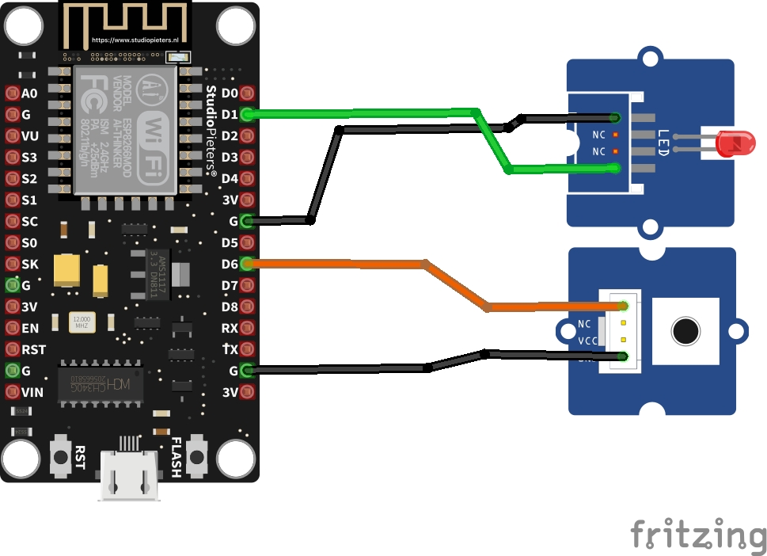
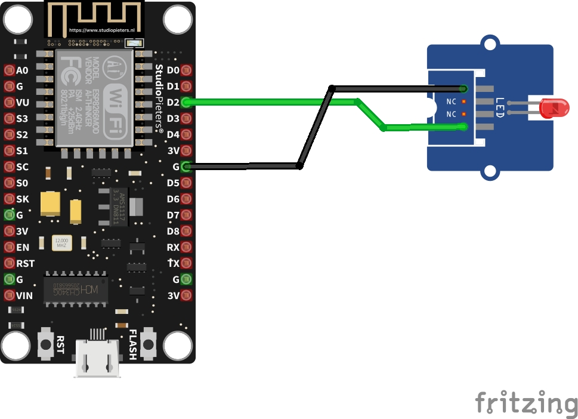
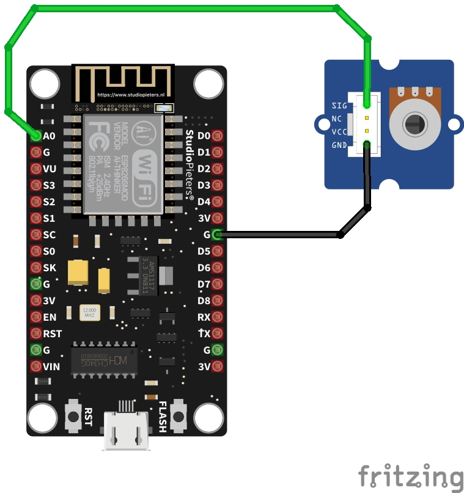

# Trabajando con el ESP8266

> ### Objetivos
> * Aprender a usar la tarjeta de desarrollo Node MCU.
> * Comprender el API basica de entrada y salida del lenguaje Arduino.
> * Comprender y adaptar los ejemplos usando el kit de inicio Groove.
> * Comprender el uso de algunos sensores y actuadores basicos.

## Introducción

El NodeMCU es una plataforma de código abierto con conectividad wifi basada en el SoC ESP8266 ([datasheet](0a-esp8266ex_datasheet_en.pdf)). Esto la hace una plataforma ideal para el desarrollo de proyectos IoT.


## Material requerido

1. Tarjeta NodeMcu V3 para ESP8266 
2. Cable USB tipo C.
3. Grove - Starter Kit v3 ([link](https://wiki.seeedstudio.com/Grove_Starter_Kit_v3/))
4. Grove Base Shield for NodeMCU V1.0
 ([link](https://wiki.seeedstudio.com/Grove_Base_Shield_for_NodeMCU_V1.0/))

## Trabajo previo con fritzing

Antes de empezar a trabajar 

Para realizar prototipado empleando elementos (de diferentes fabricantes) disponibles en kits de desarrollo a trabajar en el laboratorio siga los pasos ilustrados en el tutorial [How to Add Components in Fritzing](https://steemit.com/utopian-io/@thinkingmind/how-to-add-components-in-fritzing) (para comprender bien el procedimiento puede ver el siguiente [video](https://www.youtube.com/watch?v=lEEkYk5IQVY) antes de empezar). Para ello agregar los siguientes componentes:
1. **NodeMCU y otros componentes**: Estos componentes se pueden obtener del siguiente [repositorio](https://github.com/AchimPieters/Fritzing-Custom-Parts) mas exactamente realizar la descarga de la siguiente [pagina](https://github.com/AchimPieters/Fritzing-Custom-Parts/releases/tag/0.0.2) seleccionando el archivo [Fritzing.parts](https://github.com/AchimPieters/Fritzing-Custom-Parts/releases/download/0.0.2/Fritzing.parts.zip) (Pagina del autor: [https://www.studiopieters.nl/esp8266-programmer/](https://www.studiopieters.nl/esp8266-programmer/))
2. **Grove**: Descargar el archivo [seeed_fritzing_parts.fzbz](https://github.com/Seeed-Studio/fritzing_parts/blob/master/seeed_fritzing_parts.fzbz) del siguiente [repositorio](https://github.com/Seeed-Studio/fritzing_parts)
3. **Elegoo**: Las partes se encuentran en el siguiente [repositorio](https://github.com/marcinwisniowski/ElegooFritzingBin). Para ello descargue [Elegoo-0.6.3.fzbz](https://github.com/marcinwisniowski/ElegooFritzingBin/releases/download/0.6.3/Elegoo-0.6.3.fzbz)
4. **Adafruit**: Descargue el siguiente archivo [Fritzing-Library-master.zip](https://github.com/adafruit/Fritzing-Library/archive/master.zip), luego descomprima y agregue a la libreria el archivo **AdaFruit.fzbz**.

Una vez hecho lo anterior estara en la facultad de dibujar diagramas y montajes con los diferentes componentes del laboratorio.

## Pinout

Tal y como se menciono en clases anteriores, siempre el punto de partida es conocer el diagrama de pines de la tarjeta de desarrollo; este se muestra a continuación:


El mapa de pines del NodeMCU ESP8266:
* 17 GPIO’s
* SPI
* I2C (implemented on software)
* I2S interfaces with DMA
* UART
* 10-bit ADC

Adicionalmente, el esquema de numeración de los pines de la tarjeta NodeMCU (por ejemplo el pin marcado como ```D0```) es diferente del esquema de numeración del ESP8266 (esquema interno). Por ejemplo, el pin ```D0``` de la tarjeta esta mapeado al pin interno ```GPIO16```. La recomendación es usar el esquema de numeración externo. 

La siguiente tabla muestra una equivalencia entre la numeración de la tarjeta y la numeración interna:

|NodeMCU pin | ESP8266 pin |
|---|---|
|D0	| GPIO16 |
|D1	| GPIO5 |
|D2	| GPIO4 |
|D3	| GPIO0 |
|D4	| GPIO2 |
|D5	| GPIO14 |
|D6	| GPIO12 |
|D7	| GPIO13 |
|D8	| GPIO15 |
|D9	| GPIO3 |
|D10| GPIO1 |
|D11| GPIO9 |
|D12| GPIO10 |

Según la tabla anterior, es posible codificar sketches usando cualquiera de las dos nomenclaturas. Para comprender lo anterior observe el siguiente fragmento de código donde se usa el pin ```D2``` (```GPIO4```) como salida.

**Nomenclatura del NodeMCU**

```ino
pinMode(D2, OUTPUT);
digitalWrite(D2, HIGH);
```

**Nomenclatura del ESP8266**

```
pinMode(4, OUTPUT);
digitalWrite(4, HIGH);
```

Es importante tener en cuenta que el pin ```D0``` (```GPIO16```) solo puede ser usado para ```GPIO read/write```. No soporta ```open-drain/interrupt/PWM/I²C``` o ```1-Wire```. Para comprender mas sobre el esquema de mapeo ver la pagina **ESP8266 Pinout Reference: Which GPIO pins should you use?** ([link](https://randomnerdtutorials.com/esp8266-pinout-reference-gpios/))

## Arduino core for ESP8266 WiFi chip

Gracias a este pluging ([Arduino core for ESP8266 WiFi chip](https://github.com/esp8266/Arduino)) es posible programar el ESP8266 usando el funciones y librerias propias de API de arduino.

Para consultar la documentación del **ESP8266 Arduino core** puede consultar el siguiente link [[Documentación en ingles](https://arduino-esp8266.readthedocs.io/en/3.0.2/)|[Documentación en español](https://esp8266-arduino-spanish.readthedocs.io/es/latest/)].

En el siguiente [link](ESP8266%20cheat%20sheet.pdf) se resumen algunas de las funciones del pluging del arduino para el ESP8266.

Para usar el **ESP8266 Arduino core** siga las instrucciones mostradas en el siguiente [tutorial](https://learn.sparkfun.com/tutorials/esp8266-thing-hookup-guide/all#installing-the-esp8266-arduino-addon).

## Ejemplos

A continuación se van a mostrar los ejemplos hechos en arduino [link](../arduino_uno/) adaptados a la plataforma ESP8266.

### Ejemplo 1

Poner parpadear un led a un periodo de 2 segundos usando el led de la tarjeta NodeMCU. (Código tomado de [Cómo programar NodeMCU con el IDE de Arduino](https://programarfacil.com/esp8266/como-programar-nodemcu-ide-arduino/)) 

```ino
#define LED_BUILTIN 2

void setup() {
  pinMode(LED_BUILTIN, OUTPUT);
}

// the loop function runs over and over again forever
void loop() {
  digitalWrite(LED_BUILTIN, HIGH);  
  delay(1000);                       
  digitalWrite(LED_BUILTIN, LOW);    
  delay(1000);                       
}
```

El funcionamiento (tomado de la pagina original) se muestra a continuación:


Por otro lado, si lo que se hubiera pedido hubiera sido poner a parparear un led, pero en esta ocasión usando el puerto ```D5``` (```GPIO14```), el código tendria un minimo cambio tal y como se muestra a continuación (Codigo tomado de [Example Sketch: Blink](https://learn.sparkfun.com/tutorials/esp8266-thing-hookup-guide/all#example-sketch-blink)):

```ino
#define ESP8266_LED D5 // D5 = 14

void setup() 
{
  pinMode(ESP8266_LED, OUTPUT);
}

void loop() 
{
  digitalWrite(ESP8266_LED, HIGH);
  delay(500);
  digitalWrite(ESP8266_LED, LOW);
  delay(500);
}
```

La conexión asociada al codigo anterior se muestra a continuación:




### Ejemplo 2

Prender el led integrado de la placa NodeMCU  cuando se presiona un switch. (Código tomado de [Cómo programar NodeMCU con el IDE de Arduino](https://programarfacil.com/esp8266/como-programar-nodemcu-ide-arduino/))


```ino
#define LED_BUILTIN 2
#define BUTTON_BUILTIN 0 
 
void setup() { 
  pinMode(LED_BUILTIN, OUTPUT);
  pinMode(BUTTON_BUILTIN, INPUT);
} 
 
void loop() {
  int estado = digitalRead(BUTTON_BUILTIN); 
  digitalWrite(LED_BUILTIN, estado); 
}
```

La siguiente imagen (tomada de la pagina original) muestra el funcionamiento del codigo anterior una vez este ha sido descargado a la tarjeta.


A continuación se muestra el mismo ejemplo anterior pero en este caso se usan los siguientes puertos:

|Elemento|Puerto|Componente|
|---|---|---|
|Switch|```D6``` (```GPIO12```)|[Grove - Red LED](https://wiki.seeedstudio.com/Grove-Red_LED/)|
|Led|```D1``` (```GPIO5```)|[Grove - Button](https://wiki.seeedstudio.com/Grove-Button/)|


```ino
/* Pin Definitions */
const int LED_PIN = 5; // D1 = GPIO5
const int BUTTON_PIN = 12; // D6 = GPIO12
 
void setup() { 
  pinMode(LED_PIN, OUTPUT);
  pinMode(BUTTON_PIN, INPUT);
} 
 
void loop() {
  int estado = digitalRead(BUTTON_PIN); 
  digitalWrite(LED_PIN, estado); 
}
```

A continuación se muestra la conexión del ejemplo anterior usando los componentes ([Grove - Red LED](https://wiki.seeedstudio.com/Grove-Red_LED/) y [Grove - Button](https://wiki.seeedstudio.com/Grove-Button/)) del kid groove:



### Ejemplo 3

Modifica el brillo de un led (conectado al pin ```D2``` (```GPIO4```)) de manera automatica.

```ino
/* Pin Definitions */
const int ledPin = D2; // D1 = GPIO4
  

void setup() {
  // nothing happens in setup
}

void loop() {

  for (int fadeValue = 0 ; fadeValue <= 255; fadeValue += 5) {
    analogWrite(ledPin, fadeValue);
    delay(30);

  }

  for (int fadeValue = 255 ; fadeValue >= 0; fadeValue -= 5) {
    analogWrite(ledPin, fadeValue);
    delay(30);
  }
}
```

A continuación se muestra el diagrama de conexión usando el [Grove - Red LED](https://wiki.seeedstudio.com/Grove-Red_LED/) para el código anterior:




### Ejemplo 4

```
/* Pin Definitions */
const int ANALOG_PIN = A0; // A0

void setup() {
  Serial.begin(9600);
}

void loop() {
  int sensorValue = analogRead(ANALOG_PIN);
  Serial.println(sensorValue);
  delay(1);        
}
```

Para este caso, se conecto al pin ```A0``` el [Grove - Rotary Angle Sensor](https://wiki.seeedstudio.com/Grove-Rotary_Angle_Sensor/)





## Enlaces

* https://create.arduino.cc/projecthub/electropeak/getting-started-w-nodemcu-esp8266-on-arduino-ide-28184f
* https://create.arduino.cc/projecthub/364744/capacitive-fingerprint-sensor-with-an-arduino-or-esp8266-b1b8bd?ref=similar&ref_id=164743&offset=1
* https://create.arduino.cc/projecthub/support/iot-blink-getting-started-with-iot-451da6?ref=similar&ref_id=164743&offset=4
* https://create.arduino.cc/projecthub/hbolanos2001/wifi-esp8266-and-dht22-sensor-09d455?ref=search&ref_id=esp8266&offset=9
* https://programarfacil.com/esp8266/como-programar-nodemcu-ide-arduino/
* https://github.com/UdeA-IoT/actividad-5
* https://naylampmechatronics.com/blog/56_usando-esp8266-con-el-ide-de-arduino.html 
* https://randomnerdtutorials.com/learn-esp32-with-arduino-ide/
* https://www.tutorialspoint.com/esp32_for_iot/esp32_for_iot_quick_guide.htm
* https://iotconsulting.tech/comunica-esp8266-con-adafruit-io/
* https://www.arduino.cc/reference/en/libraries/adafruit-esp8266/
* https://learn.sparkfun.com/tutorials/esp8266-thing-development-board-hookup-guide/introduction
* https://learn.sparkfun.com/tutorials/esp8266-wifi-shield-hookup-guide/all#introduction
* https://randomnerdtutorials.com/projects-esp8266/
* https://www.espressif.com/en/ecosystem/community-engagement/courses?field_type_tid=All&field_course_language_tid=All&page=2
* https://github.com/espressif/arduino-esp32
* https://www.espressif.com/sites/default/files/documentation/esp8266_hardware_design_guidelines_en.pdf
* https://esphome.io/devices/nodemcu_esp8266.html
* https://www.wikiwand.com/en/ESP8266
* https://randomnerdtutorials.com/esp8266-pinout-reference-gpios/
* https://www.prometec.net/modelos-esp8266/
* https://hardzone.es/reportajes/tema/esp8266-2n2222-arduino/
* https://github.com/esp8266/Arduino
* https://github.com/nodemcu/nodemcu-devkit-v1.0
* https://naylampmechatronics.com/espressif-esp/153-nodemcu-v2-esp8266-wifi.html
* https://create.arduino.cc/projecthub
* https://esp8266-arduino-spanish.readthedocs.io/es/latest/
* https://nodemcu.readthedocs.io/en/release/
* https://randomnerdtutorials.com/projects-esp8266/
* https://randomnerdtutorials.com/projects-esp32/
* https://randomnerdtutorials.com/home-automation-using-esp8266/
* https://www.prometec.net/modelos-esp8266/
* https://acis.org.co/archivos/Conferencias/2018/Conferencia0504.pdf
* https://www.arduino.cc/reference/en/libraries/adafruit-esp8266/
* https://learn.adafruit.com/adafruit-huzzah-esp8266-breakout
* https://www.adafruit.com/product/2471
* https://learn.adafruit.com/adafruit-io-basics-esp8266-arduino
* https://www.esp8266.com/wiki/doku.php?id=esp8266-module-family#esp-06
* https://hackaday.com/tag/esp8266/
