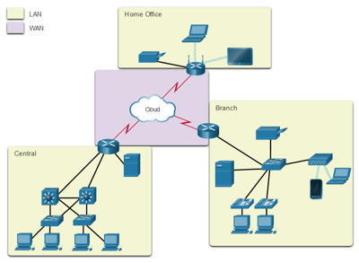

# Conceptos básicos de capa fisica

## Tipos de redes

Las infraestructuras de red pueden variar en gran medida en términos de:
* El tamaño del área que abarcan.
* La cantidad de usuarios conectados.
* La cantidad y los tipos de servicios disponibles.
* El área de responsabilidad

A continuación se muestra una clasificación simple

* **Red de area personal**: Es una red que conecta diferentes dispositivos dentro de un area pequeña. Este tipo de red conecta tipicamente wearables. 
* **Red de área local (LAN)**: Es una infraestructura de la red que abarca un área geográfica pequeña. Las redes residenciales, SOHO y corporativas son casos tipicos de este tipo. 
* **Red de área amplia (WAN)**: Es una infraestructura de la red que abarca un área geográfica extensa. Permiten la conexión de varias redes LAN entre sí.



La siguiente tabla muestra las tecnologias usadas en la implementación de los diferentes tipos de redes:

|Tipo|Tecnologias|
|---|---|
|PAN|Bluetooth radio, Bluetooth Low Energy, ZigBee, Z-Wave, Thread, 6LoWPAN, Wired|
|LAN| Wi-Fi, Ethernet|
|MAN| SigFox, LoRaWAN, NB-IOT (Narrow Band IOT) |

## Bandas ISM

Las bandas ISM (Industrial, Scientific and Medical) son bandas de radio frecuencia reservadas internacionalmente para el uso con propósitos industriales, científicos y médicos.


La siguiente tabla resume las diferentes tecnologias de comunicación inalambrica resaltando las frecuencias de operación para cada caso:

|Caracteristica|Bluetooth Classic | Bluetooth Low Energy | Bluetooth Mesh | Zigbee | Wi-Fi | LTE-M |NB-IoT|Sigfox|LoRaWAN|
|---|---|---|---|---|---|---|---|---|---|
|Rango| Hasta 100 m| Hasta 200 m o 400 m con LR|Hasta 200 m|Hasta 200 m|Hasta 200 m|Hasta 10 km|Hasta 10 km|Hasta 50 km|Hasta 20 km|
|Frecuencia|2.4 GHz|2.4 GHz|2.4 GHz|2.4 GHz|2.4 GHz, 5 GHz|---|---|915 MHz (America)|902 MHz |
|Throughput|Hasta 3 Mbps|Hasta 2 Mbps|Hasta 1 Mbps|Hasta 250 Kbps|Hasta 100 Mbps|Hasta 1 Mbps|Hasta 200 Kbps|Hasta 100 bps|10 Kbps - 50 Kbps|
|Ongoing cost|Una vez|Una vez|Una vez|Una vez|Una vez|Recurrente|Recurrente|Recurrente|Una vez|
|Consumo de potencia|Bajo|Bajo|Bajo|Bajo|Medio|Medio|Bajo|Bajo|Bajo|
|Costo del módulo|Menores de $5|Menores de $5|Menores de $5|$8 - $15|Menores de $10|$8 - $20|Menores de $5|$8 - $15|
|Topologia|P2P, Star|P2P, Star, Broadcast|Mesh|Mesh|Star, Mesh|Star|Star|Star|Star|

Para mas información puede encontrar una comparación mas detallada en el siguiente [enlace de wikipedia](https://en.wikipedia.org/wiki/Comparison_of_wireless_data_standards).


## Librerias Wifi

Para hacer posible una conexión empleando Wifi, es necesario contar con un **Access Point (AP)**. Un **AP** es un dispositivo que permite la conexión de dispositivos Wi-Fi a una red cableada tal y como se muestra en la siguiente figura:


Para permitir la conexión de una placa Arduino a un red wifi se emplea el **Arduino WiFi**. Esto es posible gracias a la libreria **WiFi** ([link](https://www.arduino.cc/en/Reference/WiFi)) (la cual viene incluida en el Arduino IDE).
A continuación se muestran las clases de mayor uso de esta libreria:

### Clase WiFi 
La clase WiFi inicializa la biblioteca de ethernet y la configuración de red. La siguiente tabla muestra algunos de los principales métodos:

|Método|Descripción|Sintaxis|
|---|---|---|
|```WiFi.begin()```|Inicializa la configuración de red de la biblioteca WiFi y proporciona el estado actual|```WiFi.begin();``` <br> ```WiFi.begin(ssid);``` <br> ```WiFi.begin(ssid, pass);``` 
|```WiFi.disconnect()```|Desconecta la placa WiFi de la red actual.|```WiFi.disconnect();```|
|```WiFi.status()```|Devuelve el estado de la conexión (```WL_CONNECTED```, ```WL_CONNECTION_LOST```, ```WL_DISCONNECTED``` y ```WL_CONNECT_FAILED``` entre otros).|```WiFi.status();```|


### Clase IPAddress 

La clase ```IPAddress``` proporciona información sobre la configuración de la red. La siguiente tabla muestra los métodos de la clase ```Wifi``` que son empleados con esta clase:

|Método|Descripción|Sintaxis|
|---|---|---|
|```WiFi.localIP()```|Obtiene la dirección IP de la placa WiFi.|```WiFi.localIP();```|
|```WiFi.subnetMask()```|Obtiene la mascara de subred de la placa WiFi.|```WiFi.subnetMask();```|
|```WiFi.gatewayIP()```|Obtiene la dirección IP de la puerta de enlace de la placa WiFi.|```WiFi.gatewayIP();```|

### Clase Server

La clase Server crea servidores que pueden enviar y recibir datos de clientes conectados (programas que se ejecutan en otras computadoras o dispositivos). Esta clase, es la clase base de Wifi Server. Para su instanciación se emplea el siguiente constructor:

|Clase|Descripción|Sintaxis del constructor|
|---|---|---|
|```WiFiServer```|Crea un servidor que escucha las conexiones entrantes en el puerto especificado.|```Server(port);```|

A continuación se resumen algunos de los principales métodos asociados a esta clase.

|Método|Descripción|Sintaxis|
|---|---|---|
|```begin()```|Le dice al servidor que comience a escuchar las conexiones entrantes.|```server.begin();```|

### Clase Client

La clase client crea clientes que pueden conectarse a servidores y enviar y recibir datos.

|Método|Descripción|Sintaxis|
|---|---|---|
|```WiFiClient()```|Crea un cliente que puede conectarse a una dirección IP y un puerto de Internet especificados como se define en ```client.connect()```.|```WiFiClient();```|
|```connected()```|Determina si el cliente está conectado o no |```client.connected();```|

Debido al uso masivo del ESP8266, se creo una libreria WiFi (la cual trata de conservar la filosofia de la libreria original para Arduino) para esta plataforma. Para consultar mas sobre esta libreria puede dirigirse a la sección del [ESP8266WiFi library](https://arduino-esp8266.readthedocs.io/en/latest/esp8266wifi/readme.html) API de [ESP8266 Arduino Core](https://arduino-esp8266.readthedocs.io/en/latest/index.html).

Para mayor información puede consultar:
1. [Arduino WiFi library](https://www.arduino.cc/en/Reference/WiFi)
2. [ESP8266 Arduino Core’s](https://arduino-esp8266.readthedocs.io/en/latest/index.html)
3. [ESP8266 Arduino Core’s en español](https://esp8266-arduino-spanish.readthedocs.io/es/latest/#)
   

## Ejemplos

A continuación se van a realizar una serie de ejemplos que muestran como conectar las cosas (en nuestro caso el NodeMCU) a la red empleando Wifi. 

Por comodidad se muestra el diagrama de pines del disposivo:


### Básicos

1. El siguiente ejemplo (tomado de la sección [Librería ESP8266WiFi](https://esp8266-arduino-spanish.readthedocs.io/es/latest/esp8266wifi/readme.html)) del manual **ESP8266 Arduino Core** muestra como conectar el modulo ESP a un access point.

   **Solución**: [código 1](basico1/README.md)

2. A veces puede ser útil poner a funcionar un modulo ESP8266 como wireless access point (AP) lo cual le permite establecer su propia red Wifi. 

   **Solución**: [código 2](basico2/README.md)

3. Enunciado en construcción

   **Solución**: [código 3](basico3/README.md)

4. Enunciado en construcción

   **Solución**: [código 4](basico4/README.md)

5. Enunciado en construcción

   **Solución**: [código 5](basico5/README.md)

6. Enunciado en construcción

   **Solución**: [código 6](basico6/README.md)


## Enlaces

1. https://wokwi.com/
2. https://markmegarry.github.io/AVR8js-Falstad/
3. https://wokwi.com/
4. https://tawjaw.github.io/Arduino-Robot-Virtual-Lab/
5. https://tawjaw.github.io/Arduino-Robot-Virtual-Lab/index.html
6. https://forum.arduino.cc/t/virtual-online-arduino-and-esp32-simulator-wokwi-arduino-simulator-features/698481/5
7. http://iotfactory.eu/iot-knowledge-center/overview-of-iot-networks/
8. https://www.c-sharpcorner.com/UploadFile/f88748/internet-of-things-iot-an-introduction/
9. https://www.c-sharpcorner.com/UploadFile/f88748/internet-of-things-part-2/
10. https://www.c-sharpcorner.com/UploadFile/f88748/internet-of-things-iot-part-3/
11. https://www.c-sharpcorner.com/UploadFile/f88748/internet-of-thingsiot-part-4-network-protocols-and-arc/
12. https://www.ccontrols.net/cz-sk/applications/internet-of-things-iot/wireless-networks/
13. https://www.sam-solutions.com/blog/internet-of-things-iot-protocols-and-connectivity-options-an-overview/
14. https://www.lanner-america.com/es/iot/
15. https://en.wikipedia.org/wiki/Comparison_of_wireless_data_standards
16. https://www.digikey.com/en/articles/comparing-low-power-wireless-technologies
17. https://www.digikey.com/en/articles/comparing-low-power-wireless-technologies-part-2
18. https://bismark.net.co/como-avanzan-redes-lpwan/
19. http://www.ane.gov.co/Documentos%20compartidos/ArchivosDescargables/consultapublica/contenidos/ComentariosAnexoNormatividadUsoLibre/Respuesta_Comentarios_Anexo_Normatividad_Uso_Libre.pdf
20. https://www.aprendiendoarduino.com/tag/sigfox/
21. https://repositorio.uchile.cl/bitstream/handle/2250/171099/Evaluacion-del-protocolo-HTTP2-para-Internet-de-las-cosas.pdf?sequence=1&isAllowed=y
22. https://editores-srl.com.ar/sites/default/files/aa2_semle_protocolos_ilot.pdf
23. https://forum.huawei.com/enterprise/es/protocolo-http-en-iot-miuconhuawei/thread/624779-100275
24. https://cloud.google.com/blog/products/iot-devices/http-vs-mqtt-a-tale-of-two-iot-protocols
25. https://microsoft.github.io/IoT-For-Beginners/#/2-farm/lessons/2-detect-soil-moisture/README
26. https://docs.microsoft.com/en-us/azure/iot-hub/iot-hub-devguide-protocols
27. https://docs.oracle.com/en/cloud/paas/iot-cloud/iotrq/toc.htm
28. https://www.nabto.com/rest-api-iot-guide/
29. https://docs.microsoft.com/en-us/rest/api/iothub/
30. https://github.com/homieiot/homie-esp8266
31. https://openforce.com/de/blog/openhab-mqtt-homie/
32. https://www.instructables.com/Building-Homie-Devices-for-IoT-or-Home-Automation/
33. https://diyprojects.io/getting-start-homie-library-mqtt-connected-objects-esp8266/#.YbDMOL3MLIU
34. http://revistas.unisimon.edu.co/index.php/innovacioning/article/view/3771/4701
35. https://aprendiendoarduino.wordpress.com/2017/10/11/saber-mas-iniciacion-arduino-2017/
36. http://www.microhomie.com/en/master/
37. https://arest.io/
38. http://dweet.io/
39. https://create.arduino.cc/projecthub/frankzhao/iot4car-1b07f1
40. https://bossinsights.com/integrations/iot/adafruit/
41. https://learn.sparkfun.com/tutorials/esp8266-thing-hookup-guide?_ga=2.146596982.374019962.1638969666-812475524.1634861735
42. http://lucstechblog.blogspot.com/2019/07/esp-webserver-tutorial-part-1-textfields.html
43. https://www.esp8266.com/
44. https://learn.sparkfun.com/tutorials/internet-of-things-experiment-guide
45. https://learn.sparkfun.com/tutorials/photon-remote-water-level-sensor#setting-up-text-alerts
46. https://docs.arduino.cc/cloud/iot-cloud/tutorials/esp-32-cloud
47. https://docs.arduino.cc/built-in-examples/control-structures/WhileStatementConditional
48. https://docs.arduino.cc/tutorials/generic/basic-servo-control
49. https://docs.arduino.cc/tutorials/generic/introduction-to-the-serial-peripheral-interface
50. https://programarfacil.com/podcast/proyectos-iot-con-arduino/
51. https://www.instructables.com/Send-SMS-from-Arduino-over-the-Internet-using-ENC2/
52. https://www.networkworld.com/article/3133738/dweetio-a-simple-effective-messaging-service-for-the-internet-of-things.html
53. https://github.com/gamo256/dweet-esp
54. https://www.hackster.io/javier-munoz-saez/esp8266-sending-data-to-an-online-deskboard-3e7e91
55. https://www.fatalerrors.org/a/building-a-simple-internet-of-things-project-with-esp8266.html