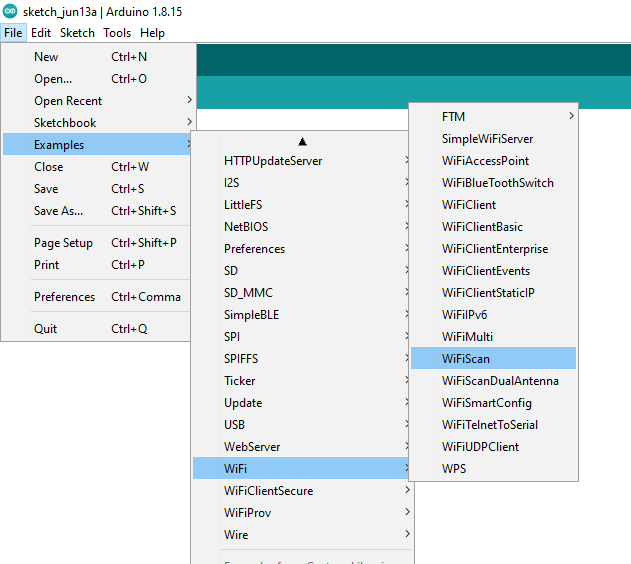

# Conexión wifi para el ESP32

## Antes de empezar

* https://randomnerdtutorials.com/getting-started-with-esp32/
* https://randomnerdtutorials.com/esp32-pinout-reference-gpios/
* https://randomnerdtutorials.com/installing-the-esp32-board-in-arduino-ide-windows-instructions/

## Arduino core for the ESP32

Como previamente se habia mencionado, el ESP32 es una evolución del ESP8266. En el laboratorio se cuentan con varios modulos [NodeMCU-32S](https://docs.ai-thinker.com/_media/esp32/docs/nodemcu-32s_product_specification.pdf). La siguiente lista resalta algunas referencias de utilidad si lo que se desea es sobre el ESP32:
* **ESP32 - Pagina del fabricante** ([link](https://www.espressif.com/en/products/socs/esp32))
* **ESP-IDF Programming Guide** ([link](https://docs.espressif.com/projects/esp-idf/en/latest/esp32/))
* **Arduino core for the ESP32** ([link](https://espressif.github.io/arduino-esp32/))

En nuestro caso vamos a hacer enfasis en el **Arduino core for the ESP32** ([link](https://espressif.github.io/arduino-esp32/)) que es donde se encuentra toda la información para programar el ESP32 haciendo uso del API de arduino ([link](https://docs.espressif.com/projects/arduino-esp32/en/latest/)). 

Antes de empezar es importante ver las librerias disponibles en el API las cuales se pueden ver en el siguiente [link](https://docs.espressif.com/projects/arduino-esp32/en/latest/libraries.html).


## Arduino core for the ESP32: Wi-Fi API

Como en nuestro caso, lo que nos interesa es analizar como se puede conectar el ESP32 a una red WiFi, la información mas relevante se encuentra en [Wi-Fi API](https://docs.espressif.com/projects/arduino-esp32/en/latest/api/wifi.html) asi que nos concentraremos en dar una vista rapida de este antes de poner algunos ejemplos.

Sobre el API, en la pagina se menciona:

> ### **About**
> The Wi-Fi API provides support for the 802 11b/g/n protocol driver. This API includes:
> * Station mode (STA mode or Wi-Fi client mode)ESP32 connects to an access point 
> * AP mode (aka Soft-AP mode or Access Point mode) Devices connect to the ESP32
> * Security modes (WPA, WPA2, WEP, etc).
> * Scanning for access points

Como punto de partida básico es bueno recordar los roles que puede tomar el ESP32 dentro de una red Wi-Fi:
* **Access Point (AP)**: En este modo, el ESP32 es configurado como un access point (AP) permitiendo la conexión entre los otros dispositivos (Stations) de la red.
 


* **Station (STA)**: En este caso, el ESP32 se conecta, como cualquier otro dispositivo, a la red Wi-Fi a traves de un Access Point.
 


## Prueba de conectividad

Antes de empezar, lo primero que debemos realizar es una prueba basica para verificar el Wi-Fi del modulo **NodeMCU-32S**. De modo que siga los siguientes pasos:
1. Abra el Arduino IDE.
2. Seleccione la placa (**Tools > Board > ESP32 Arduino > NodeMCU-32s**).


2. Conecte el modulo NodeMCU-32S al PC.

4. Seleccione el puerto.


5. En la sección de ejemplos (**examples**) busque los ejemplos relacionados con el **NodeMCU-32S** (**Examples for NodeMCU-32S**) y busque el que dice **WifiScan**,asi: **File > Examples > Wifi > WiFiScann**)


   
6. Compile y descargue el ejemplo a la tarjeta. A diferencia de las otras tarjetas, antes de proceder a la descarga del firmware, en este caso debe dejar presionado el boton **1OO** de la tarjeta y liberarlo apenas aparezca el mensaje ```Connecting...``` en los mensajes de la consola de descarga (Para mas infromación ver: [Getting Started with the ESP32 Development Board](https://randomnerdtutorials.com/getting-started-with-esp32/)):


7. Probar el ejemplo configurando la terminal serial en mismo valor que aparece en el codigo del programa (115200 para este caso). Si todo esta bien, saldrá en el monitor serial la información de las redes Wi-Fi disponibles tal y como se muestra a continuación:


## Ejemplos


## Enlaces

* https://docs.espressif.com/projects/esp-idf/en/latest/esp32/
* https://www.espressif.com/en/products/socs/esp32
* https://docs.platformio.org/en/stable/boards/espressif32/nodemcu-32s.html
* https://docs.espressif.com/projects/arduino-esp32/en/latest/
* https://randomnerdtutorials.com/installing-the-esp32-board-in-arduino-ide-windows-instructions/
* https://docs.espressif.com/projects/espressif-esp-iot-solution/en/latest/index.html
* https://espressif.github.io/arduino-esp32/
* https://docs.espressif.com/projects/arduino-esp32/en/latest/libraries.html
* https://docs.espressif.com/projects/arduino-esp32/en/latest/libraries.html* 
* https://docs.espressif.com/projects/arduino-esp32/en/latest/api/wifi.html
* https://pygmalion.tech/tutoriales/robotica-basica/tutorial-camara-termica-amg8833/
* https://pygmalion.tech/tutoriales/