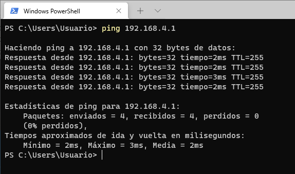
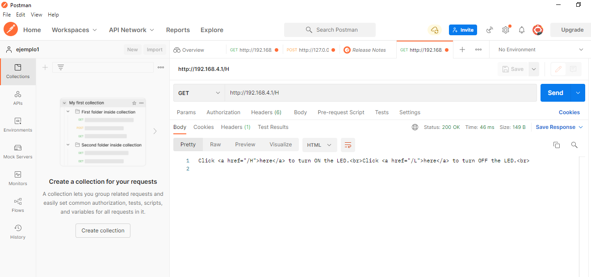
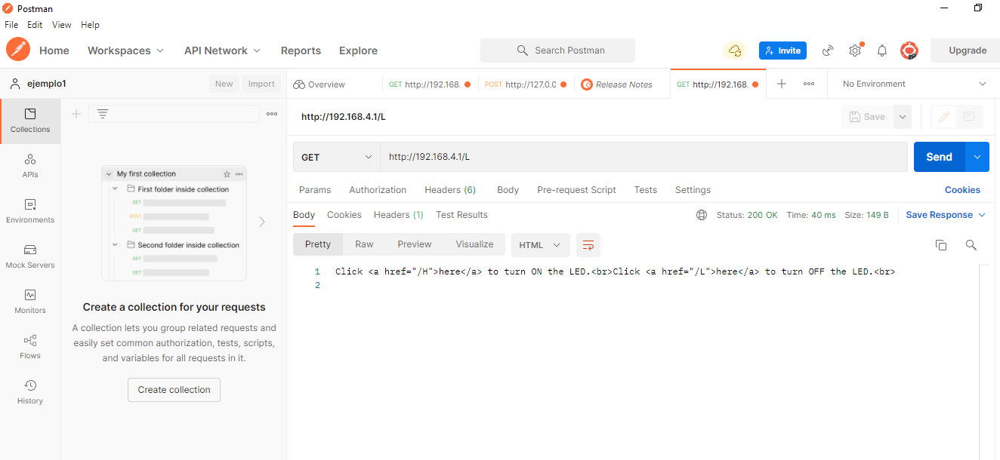

# Ejemplo 1

## Descripción

En este ejemplo se pone a funcionar el ESP32 como un AP. 


Asi mismo, se implementa un servidor en el ESP32 el cual de acuerdo a las peticiones hechas por un cliente apaga y prende el led que se encuentra integrado a la placa.

## Lista de partes

1. NodeMCU-ESP32S

## Código

Este codigo se encuentra en la documentación oficial del Wi-Fi API para el ESP32 ([link](https://docs.espressif.com/projects/arduino-esp32/en/latest/api/wifi.html)). 

```ino
/*
  WiFiAccessPoint.ino creates a WiFi access point and provides a web server on it.

  Steps:
  1. Connect to the access point "yourAp"
  2. Point your web browser to http://192.168.4.1/H to turn the LED on or http://192.168.4.1/L to turn it off
     OR
     Run raw TCP "GET /H" and "GET /L" on PuTTY terminal with 192.168.4.1 as IP address and 80 as port

  Created for arduino-esp32 on 04 July, 2018
  by Elochukwu Ifediora (fedy0)
*/

#include <WiFi.h>
#include <WiFiClient.h>
#include <WiFiAP.h>

// Set these to your desired credentials.
const char *ssid = "yourAP";
const char *password = "yourPassword";

WiFiServer server(80);


void setup() {
  pinMode(LED_BUILTIN, OUTPUT);

  Serial.begin(115200);
  Serial.println();
  Serial.println("Configuring access point...");

  // You can remove the password parameter if you want the AP to be open.
  WiFi.softAP(ssid, password);
  IPAddress myIP = WiFi.softAPIP();
  Serial.print("AP IP address: ");
  Serial.println(myIP);
  server.begin();

  Serial.println("Server started");
}

void loop() {
  WiFiClient client = server.available();   // listen for incoming clients

  if (client) {                             // if you get a client,
    Serial.println("New Client.");           // print a message out the serial port
    String currentLine = "";                // make a String to hold incoming data from the client
    while (client.connected()) {            // loop while the client's connected
      if (client.available()) {             // if there's bytes to read from the client,
        char c = client.read();             // read a byte, then
        Serial.write(c);                    // print it out the serial monitor
        if (c == '\n') {                    // if the byte is a newline character

          // if the current line is blank, you got two newline characters in a row.
          // that's the end of the client HTTP request, so send a response:
          if (currentLine.length() == 0) {
            // HTTP headers always start with a response code (e.g. HTTP/1.1 200 OK)
            // and a content-type so the client knows what's coming, then a blank line:
            client.println("HTTP/1.1 200 OK");
            client.println("Content-type:text/html");
            client.println();

            // the content of the HTTP response follows the header:
            client.print("Click <a href=\"/H\">here</a> to turn ON the LED.<br>");
            client.print("Click <a href=\"/L\">here</a> to turn OFF the LED.<br>");

            // The HTTP response ends with another blank line:
            client.println();
            // break out of the while loop:
            break;
          } else {    // if you got a newline, then clear currentLine:
            currentLine = "";
          }
        } else if (c != '\r') {  // if you got anything else but a carriage return character,
          currentLine += c;      // add it to the end of the currentLine
        }

        // Check to see if the client request was "GET /H" or "GET /L":
        if (currentLine.endsWith("GET /H")) {
          digitalWrite(LED_BUILTIN, HIGH);               // GET /H turns the LED on
        }
        if (currentLine.endsWith("GET /L")) {
          digitalWrite(LED_BUILTIN, LOW);                // GET /L turns the LED off
        }
      }
    }
    // close the connection:
    client.stop();
    Serial.println("Client Disconnected.");
  }
}
```

## Puesta en marcha

1. Antes de descargar el código a si tarjeta  configure los parametros de Red cambiando los valores de las variables ```ssid``` y ```password``` en el código anterior con los valores que quiere que tenga el AP implementado en el ESP32. En este ejemplo los valores se cambiaron a:
   * **ssid**: ```"RED-UDEA"```
   * **password**: ```"prueba123"```
2. Descargue el código.
3. Conectese desde su maquina (PC o celular) al AP implementado en el ESP32. Recuerde los parametros configurados en el código:


4. Una vez que se haya conectado puede usar el comando ping para verificar conectividad con el Access Point (AP), para ello desde una terminal ejecute el comando:

```bash
ping IP_SSID
```

Donde **IP_SSID** es la IP del access Point, que para el caso del ESP32 es **192.168.4.1**



5. Siguiendo las instrucciones (las cuales aparecen e) puede en los comentarios del código puede proceder a probar la aplicación desde su navegador favorito:


Si todo esta bien, será posible apagar y prender el led integrado en la tarjeta desde el navegador.


**Opcional**: Tambien se puede probar el funcionamiento del servidor usando **POSTMAN** o el comando **curl**. A continuación se muestra el efecto de usar el **POSTMAN**:

* **Encendido del Led**:



* **Apgando del Led**:



## Enlaces

* https://github.com/paulocsanz?tab=repositories
* https://github.com/me-no-dev?tab=repositories
* https://github.com/espressif/arduino-esp32/blob/master/libraries/WiFi/examples/WiFiAccessPoint/WiFiAccessPoint.ino
* https://github.com/hideakitai?tab=repositories
* https://help.ubidots.com/en/articles/748067-connect-an-esp32-devkitc-to-ubidots-over-mqtt
* https://help.ubidots.com/en/articles/4855281-connect-your-esp32-to-ubidots-over-http-tcp-or-udp
