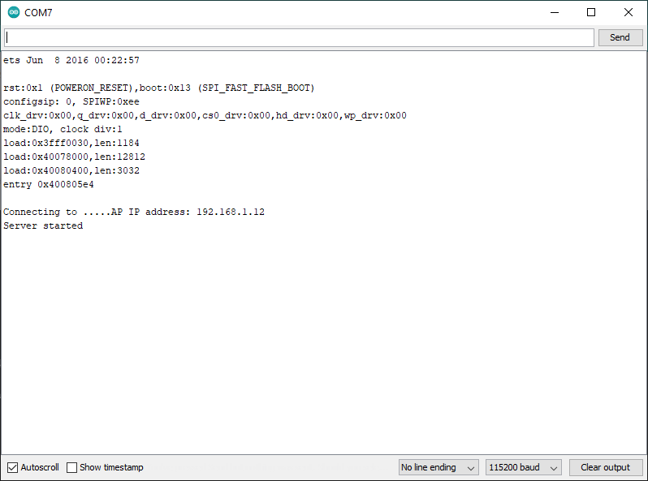
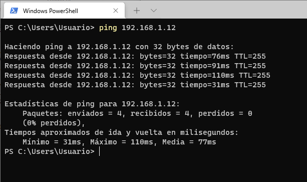
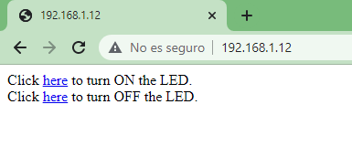
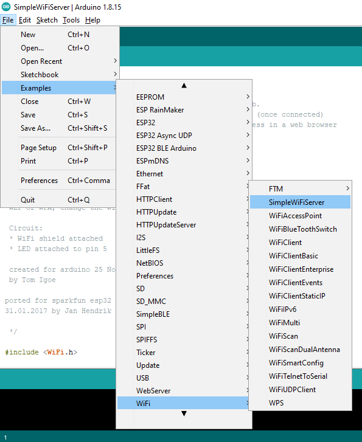

# Ejemplo 2

## Descripción

En este ejemplo se pone a funcionar el ESP32 como una estación. 


Asi mismo, se implementa un servidor en el ESP32 (exactamente el mismo del [ejemplo1](../ejemplo1/)) el cual de acuerdo a las peticiones hechas desde un cliente enciende y apaga el led que se encuentra integrado a la placa.

## Lista de partes

1. NodeMCU-ESP32S

## Código

Este codigo es practicamente el mismo, la unica diferencia es que no se usa la clase asociada a un AP. 

```ino
/*
  WiFiAccessPoint.ino creates a WiFi access point and provides a web server on it.

  Steps:
  1. Connect to the access point "yourAp"
  2. Point your web browser to http://IP_ESP32/H to turn the LED on or http://IP_ESP32/L to turn it off
     OR
     Run raw TCP "GET /H" and "GET /L" on PuTTY terminal with 192.168.4.1 as IP address and 80 as port

  Created for arduino-esp32 on 04 July, 2018
  by Elochukwu Ifediora (fedy0)
*/

#include <WiFi.h>
#include <WiFiClient.h>

// Set these to your desired credentials.
const char *ssid = "yourAP";
const char *password = "yourPassword";

// Set web server port number to 80
WiFiServer server(80);


void setup() {
  pinMode(LED_BUILTIN, OUTPUT);

  Serial.begin(115200);
  Serial.println();
  Serial.print("Connecting to ");

  // Connect to Wi-Fi network with SSID and password
  WiFi.begin(ssid, password);
  while (WiFi.status() != WL_CONNECTED) {
    delay(500);
    Serial.print(".");
  }
  
  IPAddress myIP = WiFi.localIP();
  Serial.print("AP IP address: ");
  Serial.println(myIP);
  server.begin();

  Serial.println("Server started");
}

void loop() {
  WiFiClient client = server.available();   // listen for incoming clients

  if (client) {                             // if you get a client,
    Serial.println("New Client.");           // print a message out the serial port
    String currentLine = "";                // make a String to hold incoming data from the client
    while (client.connected()) {            // loop while the client's connected
      if (client.available()) {             // if there's bytes to read from the client,
        char c = client.read();             // read a byte, then
        Serial.write(c);                    // print it out the serial monitor
        if (c == '\n') {                    // if the byte is a newline character

          // if the current line is blank, you got two newline characters in a row.
          // that's the end of the client HTTP request, so send a response:
          if (currentLine.length() == 0) {
            // HTTP headers always start with a response code (e.g. HTTP/1.1 200 OK)
            // and a content-type so the client knows what's coming, then a blank line:
            client.println("HTTP/1.1 200 OK");
            client.println("Content-type:text/html");
            client.println();

            // the content of the HTTP response follows the header:
            client.print("Click <a href=\"/H\">here</a> to turn ON the LED.<br>");
            client.print("Click <a href=\"/L\">here</a> to turn OFF the LED.<br>");

            // The HTTP response ends with another blank line:
            client.println();
            // break out of the while loop:
            break;
          } else {    // if you got a newline, then clear currentLine:
            currentLine = "";
          }
        } else if (c != '\r') {  // if you got anything else but a carriage return character,
          currentLine += c;      // add it to the end of the currentLine
        }

        // Check to see if the client request was "GET /H" or "GET /L":
        if (currentLine.endsWith("GET /H")) {
          digitalWrite(LED_BUILTIN, HIGH);               // GET /H turns the LED on
        }
        if (currentLine.endsWith("GET /L")) {
          digitalWrite(LED_BUILTIN, LOW);                // GET /L turns the LED off
        }
      }
    }
    // close the connection:
    client.stop();
    Serial.println("Client Disconnected.");
  }
}
```

## Puesta en marcha

1. Antes de descargar el código a la tarjeta  configure los parametros de Red cambiando los valores de las variables ```ssid``` y ```password``` a los parametros de la red WiFi a la cual va a conectarse la tarjeta. 
2. Descargue el código.
3. Conectese desde su maquina (PC o celular) al AP implementado en el ESP32. En la salida serial vera la dirección IP que le fue asociada a su placa:



4. Una vez que se haya conectado puede usar el comando ping para verificar conectividad con el Access Point (AP), para ello desde una terminal ejecute el comando:

```bash
ping IP_ESP32
```

Donde **IP_ESP32** es la IP que se le asigno a su placa **NODEMCU-ESP32S**, que para el caso del ESP32 es **192.168.1.12**



5. Siguiendo las instrucciones (las cuales aparecen e) puede en los comentarios del código puede proceder a probar la aplicación desde su navegador favorito:



Si todo esta bien, será posible apagar y prender el led integrado en la tarjeta desde el navegador.

### Nota

El ejemplo base (del cual se tomo el analizado previamente) encuentra dentro se los ejemplos que vienen con el IDE de Arduino (una vez se han instalado los plugings correspondientes al ESP32). Este ejemplo es **SimpleWiFiServer**; para acceder siga la siguiente ruta: **Examples > WiFi > SimpleWiFiServer** tal y como se muestra en la siguiente imagen:



## Enlaces 

* https://github.com/paulocsanz?tab=repositories
* https://github.com/me-no-dev?tab=repositories
* https://github.com/espressif/arduino-esp32/blob/master/libraries/WiFi/examples/WiFiAccessPoint/WiFiAccessPoint.ino
* https://github.com/hideakitai?tab=repositories
* https://help.ubidots.com/en/articles/748067-connect-an-esp32-devkitc-to-ubidots-over-mqtt
* https://help.ubidots.com/en/articles/4855281-connect-your-esp32-to-ubidots-over-http-tcp-or-udp
