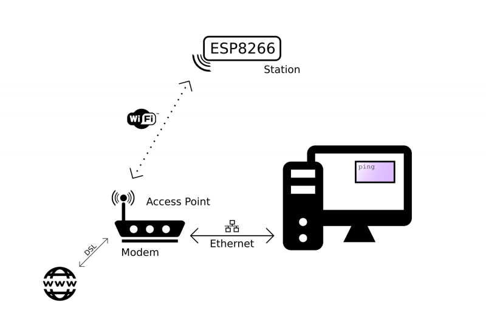
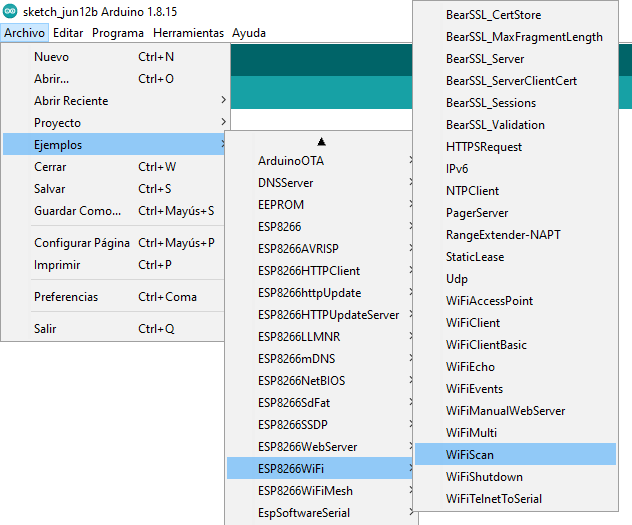

# Conexión wifi para el ESP8266

La librería WiFi para ESP8266 proporciona todas las funciones necesarias para permitir la conexión de la placa usando la tecnologia WiFi usando el API de arduino. Para saber como usar todas estas funciones es necesario conocer el **ESP8266 Arduino Core** [[Ingles](https://arduino-esp8266.readthedocs.io/en/3.0.2/)|[Español](https://esp8266-arduino-spanish.readthedocs.io/es/latest/index.html)].

Para hacer posible una conexión empleando Wifi, es necesario contar con un **Access Point (AP)**. Un **AP** es un dispositivo que permite la conexión de dispositivos Wi-Fi a una red cableada tal y como se muestra en la siguiente figura:



Los dispositivos que se conectan en una red WiFi pueden ser de dos tipos principalmente: 
* **Stations (STA)**: Dispositivos que se conectan a una red WiFi.
* **Access Points (AP)**: Dispositivos que permiten la conexión entre las diferentes estaciones que hacen parte de la red y que sirve como punto de acceso a la red cableada. Un punto de acceso generalmente se integra con un router para proporcionar acceso desde la red WiFi a Internet. Cada punto de acceso es reconocido por un SSID (Service Set IDentifier), que esencialmente es el nombre de la red que es seleccionada al conectar un dispositivo (estación) al WiFi.

En lo que respecta al SoC ESP8266 en una red WiFi, este se puede configurar para que funcione en uno de los tres modos que se muestran a continuación:
*  **Soft Access Point (soft-AP)**: Permite al SoC ESP8266 establecer su propia red WiFi lo cual le permite la conexión de otros dispositivos que funcinan como estaciones. La cantidad máxima de estaciones que pueden estar simultaneamente conectadas al SoftAP puede establecerse de 0 a 8, pero por defecto es 4. 


* **Station (STA)**: Se utiliza para conectar el módulo ESP a un Access Point de red WiFi establecida.


* **Station (STA) y Soft Access Point (soft-AP)**: Permite al ESP8266 operar simulaneamente como **STAT** y **soft-AP** lo cual, proporciona la posibilidad de construir redes WiFi malladas.


### Prueba de test

Antes de empezar a realizar ejemplos, vamos a verificar que el modulo ESP8266 tenga conectividad WiFi, para lo cual vamos a usar un como test un ejemplo de los que vienen integrados tal y como lo muestra la siguiente figura.



En esta prueba, se usa el ESP8266 para enumerar las redes disponibles (Para mas información ver la documentación de la clase [Scan](https://arduino-esp8266.readthedocs.io/en/3.0.2/esp8266wifi/scan-class.html)). 

## Clases

La librería ESP8266WiFi se divide en varias clases. En la mayoría de los casos, al escribir el código, el usuario no es conciente de esta clasificación. La siguiente figura muestra las clase de esta libreria:


A continuación se describen algunas de la principales clases .

### Clase IPAddress 

La clase ```IPAddress``` proporciona información sobre la configuración de la red. La siguiente tabla muestra los métodos de la clase ```Wifi``` que son empleados con esta clase:

|Método|Descripción|Sintaxis|
|---|---|---|
|```WiFi.localIP()```|Obtiene la dirección IP de la placa WiFi.|```WiFi.localIP();```|
|```WiFi.subnetMask()```|Obtiene la mascara de subred de la placa WiFi.|```WiFi.subnetMask();```|
|```WiFi.gatewayIP()```|Obtiene la dirección IP de la puerta de enlace de la placa WiFi.|```WiFi.gatewayIP();```|

### Clase Server

La clase Server crea servidores que pueden enviar y recibir datos de clientes conectados (programas que se ejecutan en otras computadoras o dispositivos). Esta clase, es la clase base de Wifi Server. Para su instanciación se emplea el siguiente constructor:

|Clase|Descripción|Sintaxis del constructor|
|---|---|---|
|```WiFiServer```|Crea un servidor que escucha las conexiones entrantes en el puerto especificado.|```Server(port);```|

A continuación se resumen algunos de los principales métodos asociados a esta clase.

|Método|Descripción|Sintaxis|
|---|---|---|
|```begin()```|Le dice al servidor que comience a escuchar las conexiones entrantes.|```server.begin();```|

### Clase Client

La clase client crea clientes que pueden conectarse a servidores y enviar y recibir datos.

|Método|Descripción|Sintaxis|
|---|---|---|
|```WiFiClient()```|Crea un cliente que puede conectarse a una dirección IP y un puerto de Internet especificados como se define en ```client.connect()```.|```WiFiClient();```|
|```connected()```|Determina si el cliente está conectado o no |```client.connected();```|

Debido al uso masivo del ESP8266, se creo una libreria WiFi (la cual trata de conservar la filosofia de la libreria original para Arduino) para esta plataforma. Para consultar mas sobre esta libreria puede dirigirse a la sección del [ESP8266WiFi library](https://arduino-esp8266.readthedocs.io/en/latest/esp8266wifi/readme.html) API de [ESP8266 Arduino Core](https://arduino-esp8266.readthedocs.io/en/latest/index.html).

Para mayor información puede consultar:
1. [Arduino WiFi library](https://www.arduino.cc/en/Reference/WiFi)
2. [ESP8266 Arduino Core’s](https://arduino-esp8266.readthedocs.io/en/latest/index.html)
3. [ESP8266 Arduino Core’s en español](https://esp8266-arduino-spanish.readthedocs.io/es/latest/#)
   

## Ejemplos

A continuación se van a realizar una serie de ejemplos que muestran como conectar las cosas (en nuestro caso el NodeMCU) a la red empleando Wifi. 

Por comodidad se muestra el diagrama de pines del disposivo:


### Básicos

1. El siguiente ejemplo (tomado de la sección [Librería ESP8266WiFi](https://esp8266-arduino-spanish.readthedocs.io/es/latest/esp8266wifi/readme.html)) del manual **ESP8266 Arduino Core** muestra como conectar el modulo ESP a un access point.

   **Solución**: [código 1](basico1/README.md)

2. A veces puede ser útil poner a funcionar un modulo ESP8266 como wireless access point (AP) lo cual le permite establecer su propia red Wifi. 

   **Solución**: [código 2](basico2/README.md)

3. Enunciado en construcción

   **Solución**: [código 3](basico3/README.md)

4. Enunciado en construcción

   **Solución**: [código 4](basico4/README.md)

5. Enunciado en construcción

   **Solución**: [código 5](basico5/README.md)

6. Enunciado en construcción

   **Solución**: [código 6](basico6/README.md)

## Enlaces

1. https://wokwi.com/
2. https://markmegarry.github.io/AVR8js-Falstad/
3. https://wokwi.com/
4. https://tawjaw.github.io/Arduino-Robot-Virtual-Lab/
5. https://tawjaw.github.io/Arduino-Robot-Virtual-Lab/index.html
6. https://forum.arduino.cc/t/virtual-online-arduino-and-esp32-simulator-wokwi-arduino-simulator-features/698481/5
7. http://iotfactory.eu/iot-knowledge-center/overview-of-iot-networks/
8. https://www.c-sharpcorner.com/UploadFile/f88748/internet-of-things-iot-an-introduction/
9. https://www.c-sharpcorner.com/UploadFile/f88748/internet-of-things-part-2/
10. https://www.c-sharpcorner.com/UploadFile/f88748/internet-of-things-iot-part-3/
11. https://www.c-sharpcorner.com/UploadFile/f88748/internet-of-thingsiot-part-4-network-protocols-and-arc/
12. https://www.ccontrols.net/cz-sk/applications/internet-of-things-iot/wireless-networks/
13. https://www.sam-solutions.com/blog/internet-of-things-iot-protocols-and-connectivity-options-an-overview/
14. https://www.lanner-america.com/es/iot/
15. https://en.wikipedia.org/wiki/Comparison_of_wireless_data_standards
16. https://www.digikey.com/en/articles/comparing-low-power-wireless-technologies
17. https://www.digikey.com/en/articles/comparing-low-power-wireless-technologies-part-2
18. https://bismark.net.co/como-avanzan-redes-lpwan/
19. http://www.ane.gov.co/Documentos%20compartidos/ArchivosDescargables/consultapublica/contenidos/ComentariosAnexoNormatividadUsoLibre/Respuesta_Comentarios_Anexo_Normatividad_Uso_Libre.pdf
20. https://www.aprendiendoarduino.com/tag/sigfox/
21. https://repositorio.uchile.cl/bitstream/handle/2250/171099/Evaluacion-del-protocolo-HTTP2-para-Internet-de-las-cosas.pdf?sequence=1&isAllowed=y
22. https://editores-srl.com.ar/sites/default/files/aa2_semle_protocolos_ilot.pdf
23. https://forum.huawei.com/enterprise/es/protocolo-http-en-iot-miuconhuawei/thread/624779-100275
24. https://cloud.google.com/blog/products/iot-devices/http-vs-mqtt-a-tale-of-two-iot-protocols
25. https://microsoft.github.io/IoT-For-Beginners/#/2-farm/lessons/2-detect-soil-moisture/README
26. https://docs.microsoft.com/en-us/azure/iot-hub/iot-hub-devguide-protocols
27. https://docs.oracle.com/en/cloud/paas/iot-cloud/iotrq/toc.htm
28. https://www.nabto.com/rest-api-iot-guide/
29. https://docs.microsoft.com/en-us/rest/api/iothub/
30. https://github.com/homieiot/homie-esp8266
31. https://openforce.com/de/blog/openhab-mqtt-homie/
32. https://www.instructables.com/Building-Homie-Devices-for-IoT-or-Home-Automation/
33. https://diyprojects.io/getting-start-homie-library-mqtt-connected-objects-esp8266/#.YbDMOL3MLIU
34. http://revistas.unisimon.edu.co/index.php/innovacioning/article/view/3771/4701
35. https://aprendiendoarduino.wordpress.com/2017/10/11/saber-mas-iniciacion-arduino-2017/
36. http://www.microhomie.com/en/master/
37. https://arest.io/
38. http://dweet.io/
39. https://create.arduino.cc/projecthub/frankzhao/iot4car-1b07f1
40. https://bossinsights.com/integrations/iot/adafruit/
41. https://learn.sparkfun.com/tutorials/esp8266-thing-hookup-guide?_ga=2.146596982.374019962.1638969666-812475524.1634861735
42. http://lucstechblog.blogspot.com/2019/07/esp-webserver-tutorial-part-1-textfields.html
43. https://www.esp8266.com/
44. https://learn.sparkfun.com/tutorials/internet-of-things-experiment-guide
45. https://learn.sparkfun.com/tutorials/photon-remote-water-level-sensor#setting-up-text-alerts
46. https://docs.arduino.cc/cloud/iot-cloud/tutorials/esp-32-cloud
47. https://docs.arduino.cc/built-in-examples/control-structures/WhileStatementConditional
48. https://docs.arduino.cc/tutorials/generic/basic-servo-control
49. https://docs.arduino.cc/tutorials/generic/introduction-to-the-serial-peripheral-interface
50. https://programarfacil.com/podcast/proyectos-iot-con-arduino/
51. https://www.instructables.com/Send-SMS-from-Arduino-over-the-Internet-using-ENC2/
52. https://www.networkworld.com/article/3133738/dweetio-a-simple-effective-messaging-service-for-the-internet-of-things.html
53. https://github.com/gamo256/dweet-esp
54. https://www.hackster.io/javier-munoz-saez/esp8266-sending-data-to-an-online-deskboard-3e7e91
55. https://www.fatalerrors.org/a/building-a-simple-internet-of-things-project-with-esp8266.html
56. https://learn.sparkfun.com/tutorials/esp8266-thing-hookup-guide/example-sketch-ap-web-server
57. https://github.com/lrmoreno007/ESP8266-Arduino-Spanish
58. https://github.com/esp8266
59. https://randomnerdtutorials.com/projects-esp8266/
60. https://randomnerdtutorials.com/
61. https://docs.espressif.com/projects/arduino-esp32/en/latest/libraries.html
62. https://www.esploradores.com/
63. https://tttapa.github.io/ESP8266/Chap01%20-%20ESP8266.html
64. https://www.embedded-robotics.com/esp8266-wifi/
65. https://create.arduino.cc/projecthub/projects/tags/wifi
66. https://create.arduino.cc/projecthub/projects/tags/esp8266
67. https://learn.sparkfun.com/tutorials/esp8266-thing-hookup-guide/installing-the-esp8266-arduino-addon
68. https://tttapa.github.io/ESP8266/Chap07%20-%20Wi-Fi%20Connections.html
69. https://tttapa.github.io/ESP8266/Chap01%20-%20ESP8266.html
70. https://randomnerdtutorials.com/esp8266-nodemcu-access-point-ap-web-server/
71. https://github.com/tttapa?tab=repositories
72. https://tttapa.github.io/ESP8266/Chap07%20-%20Wi-Fi%20Connections.html
73. https://tttapa.github.io/Pages/Arduino/Control-Theory/Motor-Fader/
74. https://www.esploradores.com/


