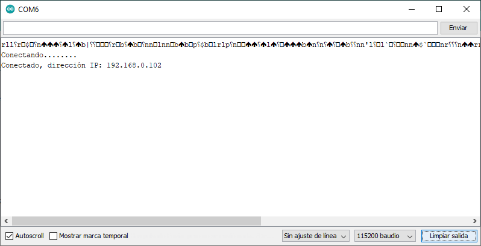

# Ejemplo 1

## Descripción

Código que muestra como realizar la conexión de un modulo ESP a un access point Wifi. La siguiente figura ilustra esta idea:


## Componentes necesarios

1. NodeMCU

## Código

El código fue tomado del siguiente [enlace](https://esp8266-arduino-spanish.readthedocs.io/es/latest/esp8266wifi/readme.html).

**Codigo:** [conexionWifi.ino](conexionWifi/conexionWifi.ino)

```arduino
#include <ESP8266WiFi.h>

void setup()
{
  Serial.begin(115200);
  Serial.println();

  WiFi.begin("nombre-red", "contraseña-red");

  Serial.print("Conectando");
  while (WiFi.status() != WL_CONNECTED)
  {
    delay(500);
    Serial.print(".");
  }
  Serial.println();

  Serial.print("Conectado, dirección IP: ");
  Serial.println(WiFi.localIP());
}

void loop() {

}
```

## Resultado

Si la conexión es exitosa se debería ver la siguiente salida en el monitor serial del Arduino IDE.



Una vez hecho lo anterior, se recomienda probar la conectividad a la red con el comando ```ping``` de la siguiente manera:

```bash
ping NodeMCU-IP
```

Para nuestro caso, como se puede ver en el monitor serial, ```NodeMCU-IP = 192.168.0.103```.