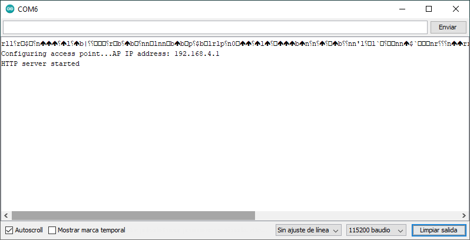
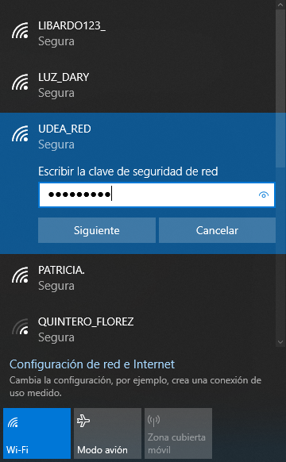
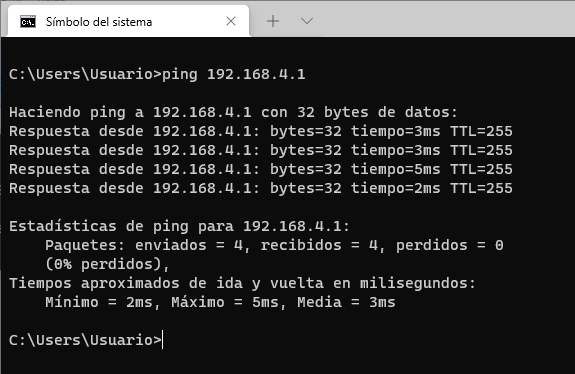
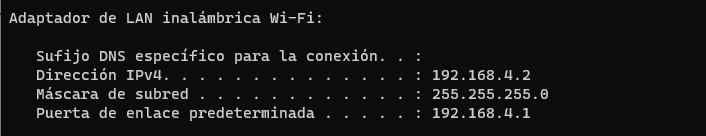
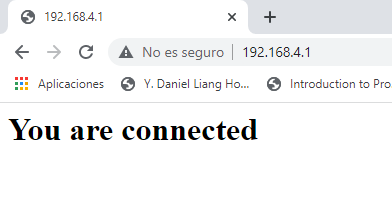

# Ejemplo 2

## Descripción

Código que muestra como configurar un modulo ESP para que funcione como access point inalambrico. La siguiente figura ilustra esta idea:


Adicionalmente el NodeMCU se configura para que funcion como servidor Web

## Componentes necesarios

1. NodeMCU

## Código

El código viene integrado con los ejemplos del ESP8266, al cual puede acceder siguiendo la siguiente ruta: **Archivo > Ejemplos > ESP8266WiFi > WiFiAccessPoint**

En nuestro caso, se modificó el nombre del SSID y la clave de acceso cambiando los valores originales de estas a **UDEA_RED** y **prueba123** respectivamente.

**Codigo:** [APSimpleWebServerWiFi.ino](APSimpleWebServerWiFi/APSimpleWebServerWiFi.ino)

```arduino
#include <ESP8266WiFi.h>
#include <WiFiClient.h>
#include <ESP8266WebServer.h>

#ifndef APSSID
#define APSSID "UDEA_RED"
#define APPSK  "prueba123"
#endif

/* Set these to your desired credentials. */
const char *ssid = APSSID;
const char *password = APPSK;

ESP8266WebServer server(80);

/* Just a little test message.  Go to http://192.168.4.1 in a web browser
   connected to this access point to see it.
*/
void handleRoot() {
  server.send(200, "text/html", "<h1>You are connected</h1>");
}

void setup() {
  delay(1000);
  Serial.begin(115200);
  Serial.println();
  Serial.print("Configuring access point...");
  /* You can remove the password parameter if you want the AP to be open. */
  WiFi.softAP(ssid, password);

  IPAddress myIP = WiFi.softAPIP();
  Serial.print("AP IP address: ");
  Serial.println(myIP);
  server.on("/", handleRoot);
  server.begin();
  Serial.println("HTTP server started");
}

void loop() {
  server.handleClient();
}
```

## Resultado

Si la conexión es exitosa se debería ver la siguiente salida en el monitor serial del Arduino IDE.



Luego de esto, se procede a conectar el PC a la red recien creada con el NodeMCU como AP:



Una vez hecho lo anterior, se recomienda probar la conectividad a la red con el comando ```ping``` con a la IP del NodeMCU, para nuestro caso:

```bash
ping 192.168.4.1
```
 Si hay conectividad la salida será:

 

 Como se muestra en la figura anterior, notese que hay conectividad, conviene tambien observar cual es la IP con la que queda el equipo, para esto puede ejecutar el comando ```ipconfig``` en Windows o ```ifconfig``` en Linux. Para nuestro caso, la IP asignada a nuestra maquina fue ```192.168.4.2```  tal y como se muestra en la siguiente figura:

  

 Finalmente solo resta acceder desde el PC a la pagina Web que esta sirviendo el NodeMCU, esto se hace digitando la IP del AP en el browser asi:

 

 