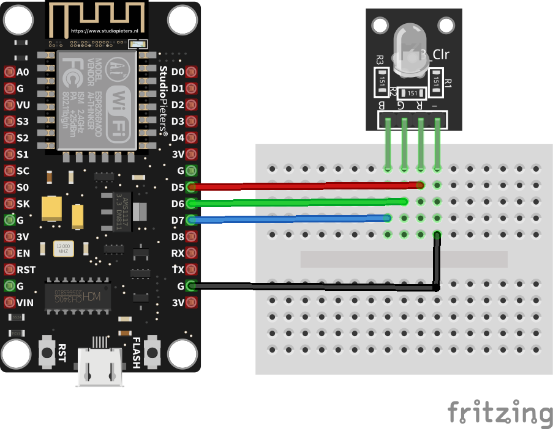

# Ejemplo 3

## Descripción

Este ejemplo conecta un NodeMCU a una red Wifi, a de tal manera que a lo largo de la conexión va cambiando el estado de un led RGB. 

## Componentes necesarios

1. NodeMCU
2. Modulo Led RGB

## Estudio previo  

En este ejemplo, simplemente se juntan los siguientes conceptos (por si desea darles una mirada):
1. Conexión del ESP8266 a una red inalambrica [link](../basico1/README.md)
2. Arduino UNO y led rgb [link](https://www.tinkercad.com/things/fr6TOjwNaOO) 

## Montaje

La siguiente figura muestra el montaje realizado:



## Código

En nuestro caso, se modificó el nombre del SSID y la clave de acceso cambiando los valores originales de estas a **UDEA_RED** y **prueba123** respectivamente.

**Codigo:** [wifi-rgb-example.ino](wifi-rgb-example/wifi-rgb-example.ino)

```arduino
// Libraries
#include <ESP8266WiFi.h>

// IO pins
int redPin = D5;
int greenPin = D6;
int bluePin = D7;

// WiFi network
const char* ssid     = "your-ssid";
const char* password = "your-password";

void setup() {
  // Config I/O ports
  setup_IO();
  // Connect to network
  setup_WIFI();
  // Led Color green
  setLedColor(0, 255, 0);
  delay(1000);  
  Serial.println("Connected...");  
  // Delay 5 seconds
  delay(5000);
}

void setup_IO() {
  // Config pines as output
  pinMode(redPin, OUTPUT);
  pinMode(greenPin, OUTPUT);
  pinMode(bluePin, OUTPUT);

  // Turn on the led with color red (No wifi connection)
  setLedColor(255, 0, 0); 
}

void setup_WIFI() {
  // Start serial
  Serial.begin(115200);
  delay(10);

  // Connecting to a WiFi network
  Serial.println();
  Serial.println();
  Serial.print("Connecting to ");
  Serial.println(ssid);
  
  WiFi.begin(ssid, password);
  
  while (WiFi.status() != WL_CONNECTED) {
    delay(500);
    Serial.print(".");
  }
  // Turn on the led with color green (Wifi connection ok)  
  //setLedColor(0, 255, 0);
  // Get net info
  Serial.println("");
  Serial.println("WiFi connected");  
  Serial.println("IP address: ");
  Serial.println(WiFi.localIP());
}

void setLedColor(int R, int G, int B) {
  analogWrite(redPin, R);
  analogWrite (greenPin, G);
  analogWrite (bluePin, B);
}

void loop() {
  setLedColor(0, 0, 0);
  delay(500);
  setLedColor(0, 0, 255);
  delay(500);
}
```

## Resultado

Si la conexión es exitosa se debería ver la siguiente verse una salida con la IP en el monitor serial del Arduino IDE y el led RGB cambiando de colores segun el estado de la conexión.

