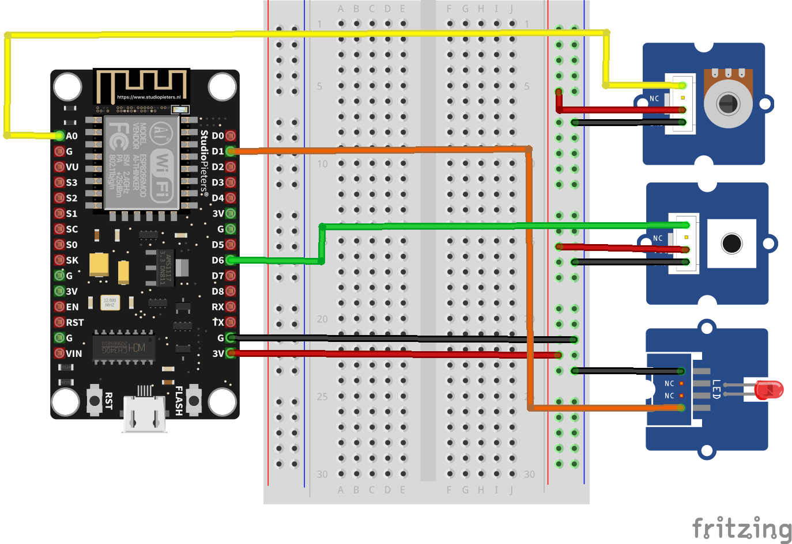

# Ejemplo 5

## Descripción

El codigo que se muestra a continuación hace que un NodeMCU funcione como Access Point inalambrico y un servidor Web. Este ejemplo es el [Example 3: Access Point (AP) Web Server](https://learn.sparkfun.com/tutorials/esp8266-thing-development-board-hookup-guide/example-sketch-web-server) tomado del tutorial de Sparkfun [ESP8266 Thing Development Board Hookup Guide](https://learn.sparkfun.com/tutorials/esp8266-thing-development-board-hookup-guide/introduction). 


## Componentes necesarios

1. NodeMCU
2. Grove Base Shield for NodeMCU V1.0 ([link](https://wiki.seeedstudio.com/Grove_Base_Shield_for_NodeMCU_V1.0/))
3. Grove - Rotary Angle Sensor ([link](https://wiki.seeedstudio.com/Grove-Rotary_Angle_Sensor/)) 
4. Grove - Red LED ([link](https://wiki.seeedstudio.com/Grove-Red_LED/))
5. Grove - Button ([link](https://wiki.seeedstudio.com/Grove-Button/))

* **Recomendación**: Tener decargadas las librerias grove de Fritzing para que pueda abrir el archivo fritzing adjunto. En el siguiente [link](https://github.com/GabrielNotman/SODAQ_Fritzing/tree/master/Fritzing%20Parts) se muestran elementos que se pueden importar.

## Conceptos previos

En este ejemplos se abordan conceptos:
1. Conexión de un ESP8266 como access point inalambrico ([link](../basico2/README.md))
2. Manejo de puertos de entrada y salida.

## Monjate

A continuación se muestra la imagen del montaje realizado



## Código

**Codigo:** [AP-spakfun-server.ino](AP-spakfun-server/AP-spakfun-server.ino)

```arduino
#include <ESP8266WiFi.h>

//////////////////////
// WiFi Definitions //
//////////////////////
const char WiFiAPPSK[] = "sparkfun";

/////////////////////
// Pin Definitions //
/////////////////////
const int LED_PIN = 5; // Thing's onboard, green LED (D1)
const int ANALOG_PIN = A0; // The only analog pin on the Thing 
const int DIGITAL_PIN = 12; // Digital pin to be read (D6)

WiFiServer server(80);

void setup() 
{
  initHardware();
  setupWiFi();
  server.begin();
}

void loop() 
{
  // Check if a client has connected
  WiFiClient client = server.available();
  if (!client) {
    return;
  }

  // Read the first line of the request
  String req = client.readStringUntil('\r');
  Serial.println(req);
  client.flush();

  // Match the request
  int val = -1; // We'll use 'val' to keep track of both the
                // request type (read/set) and value if set.
  if (req.indexOf("/led/0") != -1)
    val = 0; // Will write LED low
  else if (req.indexOf("/led/1") != -1)
    val = 1; // Will write LED high
  else if (req.indexOf("/read") != -1)
    val = -2; // Will print pin reads
  // Otherwise request will be invalid. We'll say as much in HTML

  // Set GPIO5 according to the request
  if (val >= 0)
    digitalWrite(LED_PIN, val);

  client.flush();

  // Prepare the response. Start with the common header:
  String s = "HTTP/1.1 200 OK\r\n";
  s += "Content-Type: text/html\r\n\r\n";
  s += "<!DOCTYPE HTML>\r\n<html>\r\n";

  /*Note: Uncomment the line below to refresh automatically
   *      for every 1 second. This is not ideal for large pages 
   *      but for a simple read out, it is useful for monitoring 
   *      your sensors and I/O pins. To adjust the fresh rate, 
   *      adjust the value for content. For 30 seconds, simply 
   *      change the value to 30.*/
  //s += "<meta http-equiv='refresh' content='1'/>\r\n";//auto refresh page

  // If we're setting the LED, print out a message saying we did
  if (val >= 0)
  {
    s += "LED is now ";
    s += (val)?"on":"off";
  }
  else if (val == -2)
  { // If we're reading pins, print out those values:
    s += "Analog Pin = ";
    s += String(analogRead(ANALOG_PIN));
    s += "<br>"; // Go to the next line.
    s += "Digital Pin 12 = ";
    s += String(digitalRead(DIGITAL_PIN));
  }
  else
  {
    s += "Invalid Request.<br> Try /led/1, /led/0, or /read.";
  }
  s += "</html>\n";

  // Send the response to the client
  client.print(s);
  delay(1);
  Serial.println("Client disonnected");

  // The client will actually be disconnected 
  // when the function returns and 'client' object is detroyed
}

void setupWiFi()
{
  WiFi.mode(WIFI_AP);

  // Do a little work to get a unique-ish name. Append the
  // last two bytes of the MAC (HEX'd) to "Thing-":
  uint8_t mac[WL_MAC_ADDR_LENGTH];
  WiFi.softAPmacAddress(mac);
  String macID = String(mac[WL_MAC_ADDR_LENGTH - 2], HEX) +
                 String(mac[WL_MAC_ADDR_LENGTH - 1], HEX);
  macID.toUpperCase();
  String AP_NameString = "ESP8266 Thing " + macID;

  char AP_NameChar[AP_NameString.length() + 1];
  memset(AP_NameChar, 0, AP_NameString.length() + 1);

  for (int i=0; i<AP_NameString.length(); i++)
    AP_NameChar[i] = AP_NameString.charAt(i);

  WiFi.softAP(AP_NameChar, WiFiAPPSK);
}

void initHardware()
{
  Serial.begin(115200);
  pinMode(DIGITAL_PIN, INPUT_PULLUP);
  pinMode(LED_PIN, OUTPUT);
  digitalWrite(LED_PIN, LOW);
  // Don't need to set ANALOG_PIN as input, 
  // that's all it can be.
}
```

## Resultado

Una vez descargue el programa en el NodeMCU, si todo sale bien, ya deberia estar en funcionamiento el servidor. Este tendra la IP de la placa cuando se usa  como access point  (```192.168.4.1```) y como SSID el nombre será ```ESP8266 Thing 3D0```. Al ser el NodeMCU un AP es necesario conectar el dispositivo cliente (portatil, celular, etc.) al AP. La siguiente figura muestra la conexión hecha desde un portatil con Windows. Los parametros de la red son:
* **SSID**: ESP8266 Thing 3D0
* **Clave**: sparkfun
* **IP del Access Point**: 192.168.4.1


Luego es necesario comprobar la conexión entre el portatil y el AP usando el comando ```ping```:

Ahora, asumiendo que todo fue exitoso vamos a acceder a digitar la IP del access point (192.168.4.1) en el browser:


Como se puede ver el requisito es invalido, por lo que saca un error, sin embargo dice como hacer uso de este. Los comandos correctos se muestran en la siguiente tabla:

|Acción|URL en le browser|
|---|---|
|Leer entradas analoga (A0) y digital (D5)|```192.168.4.1/read```|
|Encender Led (D1)|```192.168.4.1/led/1```|
|Apagar Led (D1)|```192.168.4.1/led/0```|

**Lectura de las entradas**

Se ejecuto el comando ```192.168.4.1/read``` para esto. La siguiente figura muestra el resultado:


Luego, se modifico el valor del potenciometro, se dejo presionado el boton y se actualizo el browser con **F5** (pues si esto no se hace los valores de las entradas no se veran actualizados en el navegador). El resultado despues de hacer esto se mostro a continuación:


**Escritura de las salidas**

Finalmente, se procede prender el led empleando el comando ```192.168.4.1/led/1```. Si todo esta bien, el resultado mostrado será:


Luego se apaga el led empleando el comando ```192.168.4.1/led/0```, de este modo la salida será:


## Actividad

Teniendo en cuenta el ejemplo de Sparkfun analizado anteriormente, adaptar y montar en el NodeMCU el ejemplo [Example 2: Station (and mDNS) Web Server](https://learn.sparkfun.com/tutorials/esp8266-thing-development-board-hookup-guide/example-sketch-web-server). Recuerde modificar los valore de las variables ```WiFiSSID``` y ```WiFiPSK``` con el nombre y la clave a la cual va a conectar la placa.
