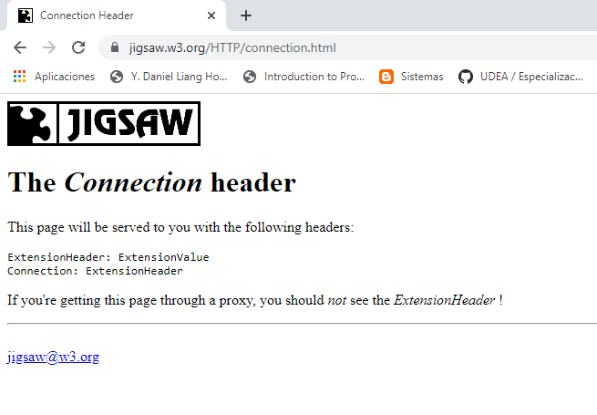

# Ejemplo 6

## Descripción

Un cliente es un dispositivo con conexión a internet que realiza peticiones a un servidor. En este ejemplo, se mostrará como el ESP8266 se puede configurar para que funcione como cliente tal y como se muestra en la siguiente figura.


Para configurar un modulo ESP como cliente se emplea la clase [Client](https://arduino-esp8266.readthedocs.io/en/2.5.0/esp8266wifi/client-class.html).

## Componentes necesarios

1. NodeMCU

## Antes de empezar

El ejemplo que se ejecutara hace una petición para obtener la pagina: https://jigsaw.w3.org/HTTP/connection.html. Esta en un navegador se veria tal y como se muestra en la siguiente figura:



El código fuente de la pagina anterior se muestra a continuación:


## Código

Para comprender el código puede analizar documentación asociada al tema tratado ([link](https://esp8266-arduino-spanish.readthedocs.io/es/latest/esp8266wifi/client-examples.html#instantiate-the-client)). El ejemplo a analizar se encuentra integrado en el API y para acceder a este se sigue la siguiente ruta: **Ejemplos > ESP8266HTTPClient > BasicHttpClient** tal y como se muestra en la siguiente figura:


Antes de descargar el ejemplo, es necesario modificar el archivo con el nombre de la red y la clave a la cual se va a conectar la placa. La siguiente figura resalta la parte de este ejemplo que se debe modificar:


**Codigo:** [wifi-client.ino](wifi-client/wifi-client.ino)

```arduino
#include <Arduino.h>

#include <ESP8266WiFi.h>
#include <ESP8266WiFiMulti.h>

#include <ESP8266HTTPClient.h>

#include <WiFiClient.h>

ESP8266WiFiMulti WiFiMulti;

void setup() {

  Serial.begin(115200);
  // Serial.setDebugOutput(true);

  Serial.println();
  Serial.println();
  Serial.println();

  for (uint8_t t = 4; t > 0; t--) {
    Serial.printf("[SETUP] WAIT %d...\n", t);
    Serial.flush();
    delay(1000);
  }

  WiFi.mode(WIFI_STA);
  WiFiMulti.addAP("SSID", "PASSWORD");

}

void loop() {
  // wait for WiFi connection
  if ((WiFiMulti.run() == WL_CONNECTED)) {

    WiFiClient client;

    HTTPClient http;

    Serial.print("[HTTP] begin...\n");
    if (http.begin(client, "http://jigsaw.w3.org/HTTP/connection.html")) {  // HTTP


      Serial.print("[HTTP] GET...\n");
      // start connection and send HTTP header
      int httpCode = http.GET();

      // httpCode will be negative on error
      if (httpCode > 0) {
        // HTTP header has been send and Server response header has been handled
        Serial.printf("[HTTP] GET... code: %d\n", httpCode);

        // file found at server
        if (httpCode == HTTP_CODE_OK || httpCode == HTTP_CODE_MOVED_PERMANENTLY) {
          String payload = http.getString();
          Serial.println(payload);
        }
      } else {
        Serial.printf("[HTTP] GET... failed, error: %s\n", http.errorToString(httpCode).c_str());
      }

      http.end();
    } else {
      Serial.printf("[HTTP} Unable to connect\n");
    }
  }

  delay(10000);
}
```

## Resultado

Si todo esta bien, una vez empieza a funcionar el programa la salida en el monitor serial seria el código html de la pagina consultada:


## Usando Postman

[Postman](https://www.postman.com/) es una aplicación ampliamente usada para testear APIs de manera facil. En el ejemplo anterior, se hizo uso del comando http GET para obtener una pagina. Esto se puede hacer empleandom en nuestro caso el comando ```curl``` de la siguiente manera:

```
curl http://jigsaw.w3.org/HTTP/connection.html
```

Sin embargo la salida no es tan clara. En la siguiente figura se hace uso del comando ```GET``` con postman (ver [link](https://learning.postman.com/docs/getting-started/sending-the-first-request/)) para nuestro caso:


Se puede notar que el resultado mostrado a continuacuón es el codigo fuente de la pagina (previamente mostrado en el monitor serial).


## Actividad

Una vez que haya comprendido el uso del modulo ESP como cliente, monte el siguiente ejemplo [ESP8266 NodeMCU HTTP GET with Arduino IDE (OpenWeatherMap.org and ThingSpeak](https://randomnerdtutorials.com/esp8266-nodemcu-http-get-open-weather-map-thingspeak-arduino/)